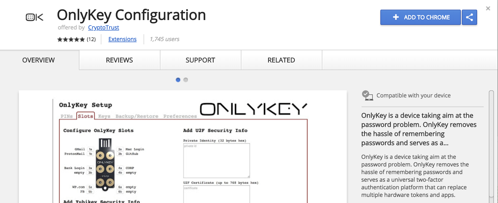
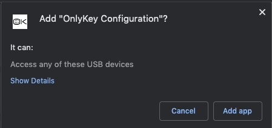
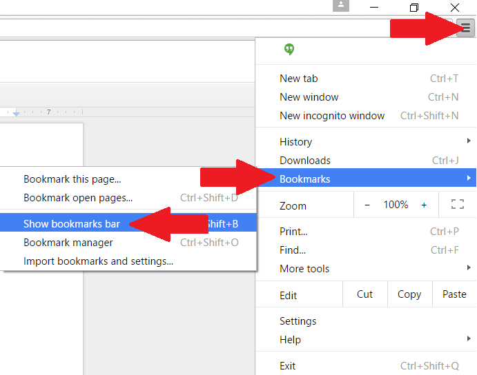
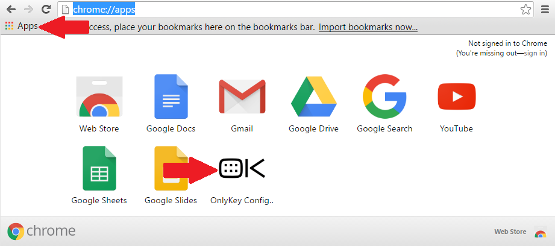

# OnlyKey App

This is the official app for **OnlyKey**

OnlyKey can be purchased here: [OnlyKey order](http://www.crp.to/p/)

## About

**OnlyKey App** is an app to be used along with an OnlyKey device. The app is used for things like:

- Initial setup of OnlyKey (PINs)
- Configuration of accounts (Slots)
- Loading keys for OpenPGP and secure backup (Keys)
- Backup and restore of OnlyKey (Backup/Restore)
- Setting OnlyKey preferences (Preferences)
- Setting advanced options (Advanced)

*The app is required on all systems where Google Authenticator (TOTP) is used*

For information on using the app with OnlyKey see the [OnlyKey User's Guide](/usersguide)

### Install OnlyKey App {#app-desktop}

:::callout
**Step 1.** Download installer
:::

[<i class="fa fa-apple fa-2x"></i> **macOS**](https://github.com/trustcrypto/OnlyKey-App/releases/download/v5.3.6/OnlyKey.App.5.3.6.dmg)

[<i class="fa fa-windows fa-2x"></i> **Windows**](https://github.com/trustcrypto/OnlyKey-App/releases/download/v5.3.6/OnlyKey_5.3.6.exe)

:::note
Windows users, there is a portable version of the app [here](https://github.com/trustcrypto/OnlyKey-App/releases/download/v5.3.6/OnlyKey_Portable_5.3.6.exe). This permits using the OnlyKey App in enterprise and environments where users may not have admin rights.
:::

[<i class="fa fa-linux fa-2x"></i> **Linux**](https://github.com/trustcrypto/OnlyKey-App/releases/download/v5.5.0/OnlyKey_5.5.0_amd64.deb)

:::note
Linux users, if a UDEV rule has not been created previously follow the following instructions [here](/linux), additionally the OnlyKey app may now be installed via snapcraft - [Linux Guide](/linux)
:::

[<i class="fa fa-chrome fa-2x"></i> **ChromeOS / ARM**](/app#onlykey-chrome-app)

:::callout
**Step 2.** Install and launch the app.
:::

:::tip
You can ensure the integrity of your downloaded file by verifying the checksum.  macOS SHA 256 CHECKSUM: 1f7756227af0752bf2d1071bf6f04e5a3282df54ac0125fdfb4abfab7edb115a Windows SHA 256 CHECKSUM: 22fc0b80d0b11fa5b0f9a566ae11edb8aee41e53905259e2a8a948c71e45e1fe Linux SHA 256 CHECKSUM: f00f056a3432d624a805596a6c6b0f2ce5d8efa8c95da1baac39599946301065  [ **Linux App GPG Public Key**](https://github.com/trustcrypto/OnlyKey-App/releases/download/v5.3.0/CryptoTrust_LLC_pub.asc) A1D6 4A3B 496C B0F3 6E12 B46F 9A9F 520D 44EA 53D1
:::

If you have an OnlyKey to set up, once you have installed the app proceed to [OnlyKey Setup](/usersguide#onlykey-setup)

### OnlyKey Chrome App 

The Chrome app has limited features and should only be used where the desktop app is unavailable such as on ChromeOS or unsupported ARM based operating systems. 

### ChromeOS

:::callout
**Step 1.** Open the Chrome (Chromium, Brave, Edge) Web Browser. If you do not have the chrome web browser installed you can install this by following the instructions here: [https://www.google.com/chrome/browser/desktop/](https://www.google.com/chrome/browser/desktop/)
:::

:::callout
**Step 2.** Click [here](https://chrome.google.com/webstore/detail/onlykey-configuration/adafilbceehejjehoccladhbkgbjmica) to browse to the OnlyKey Configuration Web app on the Chrome Web Store and select 'Add to Chrome'
:::

:::callout
**Step 3.** When prompted select ''Add App''
:::

:::callout
**Step 4.** To launch the OnlyKey Configuration App select the top right menu icon -> Bookmarks -> Show Bookmarks Bar to enable the bookmarks bar to become visible. Then select the Apps icon (Or alternatively browse to ''chrome://apps/'') and then select the ''OK'' icon to launch the OnlyKey App.
:::

 
 

 
 

### ARM Operating Systems

:::callout
**Step 1.** Download the OnlyKey Chrome App Zip file [here](https://github.com/trustcrypto/OnlyKey-App/releases/download/v5.3.6/OnlyKey_Chrome_App.zip).
:::

:::callout
**Step 2.** Go to the Extensions settings in your Chrome, Edge, or Brave browser (chrome://extensions, edge://extensions, or brave://extensions) and select 'Developer Mode' to enable loading extensions
:::

:::callout
**Step 3.** Unzip the OnlyKey Chrome App Zip file and select 'Load Unpacked' on the Extensions screen. Select the OnlyKey_Chrome_App folder, this will load the unpacked OnlyKey Chrome App.
:::

## Support

Check out the [OnlyKey Support Forum](https://forum.onlykey.io)

Check out the [OnlyKey Documentation](https://docs.crp.to)

## Source

[OnlyKey App on Github](https://github.com/trustcrypto/OnlyKey-App)


