## OpenPGP Support

OnlyKey uses the same standard OpenPGP keys used by popular services like Protonmail and Keybase. If you already have a key with these services you can use this guide to export the private key and load it onto OnlyKey. You can also use this guide to create a new private key if you don't have one. OnlyKey uses this loaded key for encrypted messages and files (see [WebCrypt](/webcrypt) and [OnlyKey Agent](/onlykey-agent)) and can use this key for secure backups of your OnlyKey (see [secure backups](/usersguide#secure-encrypted-backup-anywhere)).

For best compatibility we recommend using one of these options:

[Option A](#generating-keys-protonmail) - Create X25519 OpenPGP key with [ProtonMail](https://protonmail.com/blog/elliptic-curve-cryptography/)

[Option B](#generating-keys-keybase) - Create RSA OpenPGP key with Keybase

[Option C](#generating-keys-gpg) - Create X25519 OpenPGP or RSA key with GnuPG

|  | OnlyKey WebCrypt | Secure Backup | OnlyKey SSH Agent | OnlyKey GPG Agent | Keybase Support | Protonmail Support |
|-------|--------|---------|---------|---------|---------|---------|
| Option A | Yes | Yes | Yes | Yes | Yes | Yes |
| Option B | Yes | Yes | Yes | Yes | Yes | No |
| Option C | Yes | Yes | Yes | Yes | Yes | No |

To use an existing OpenPGP key follow the steps in [Exporting Keys](#exporting-keys).

If you wish to generate a new key, follow the steps below:

### Generating Keys {#generating-keys}

#### Generate OpenPGP Key Using ProtonMail {#generating-keys-protonmail}

:::warning
Only generate keys on a computer that you trust (i.e. never a publicly accessible or shared workstation).
:::

:::callout
**Step 1.** Create a free ProtonMail account [here](https://protonmail.com/signup).
:::

:::callout
**Step 2.** Follow the instructions in the [Protonmail knowledge base here](https://proton.me/news/elliptic-curve-cryptography) to add new ECC X25519 key
:::

:::callout
**Step 3.** Follow the instructions in the [Protonmail knowledge base here](https://proton.me/support/download-public-private-key) to Download your private key
:::

:::callout
**Step 4.** Follow the instructions [here](#loading-keys) to load key onto OnlyKey
:::

#### Generate OpenPGP Key Using Keybase {#generating-keys-keybase}

:::warning
Only generate keys on a computer that you trust (i.e. never a publicly accessible or shared workstation).
:::

:::tip
Prefer a how-to video? Watch one [here](https://vimeo.com/374512727)<br>[](https://vimeo.com/374512727)
:::

:::callout
**Step 1.** Go to https://keybase.io
:::

:::callout
**Step 2.** Select Login
:::

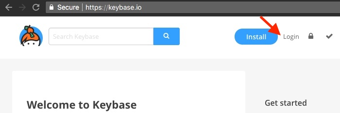

:::callout
**Step 3.** Select Join Keybase
:::

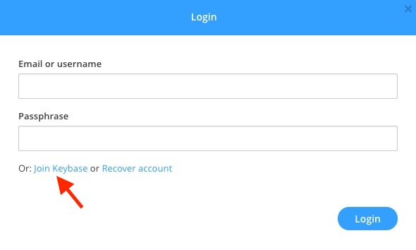

:::callout
**Step 4.** Enter an email address, username, and passphrase. This username will be used by others who want to send you encrypted messages. When finished select join.
:::

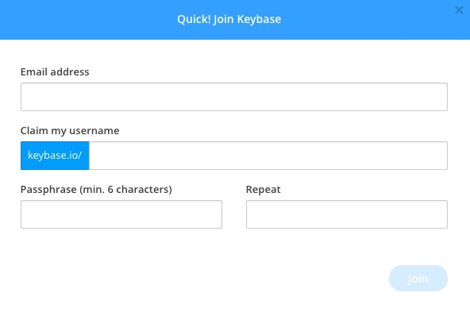

:::callout
**Step 5.** Select add a PGP key
:::

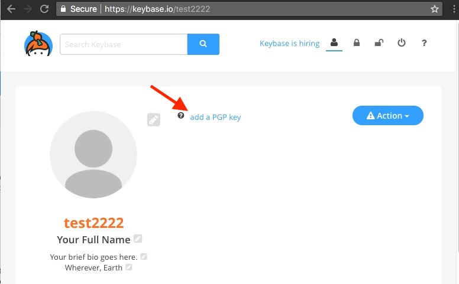

:::callout
**Step 6.** Select I need a public key
:::

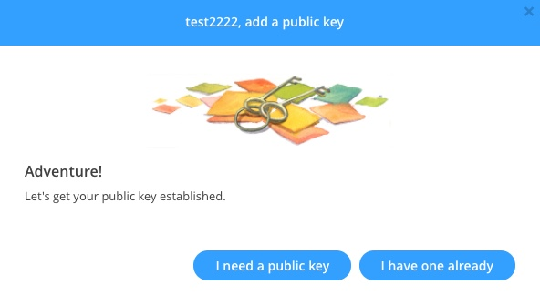

:::callout
**Step 7.** Select Ok, got it
:::

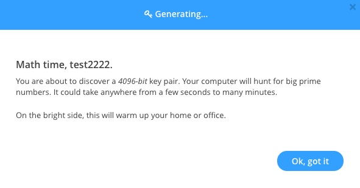

:::callout
**Step 8.** Enter Full name and at least one email. These will appear on the messages you send. When finished select Let the math begin.
:::

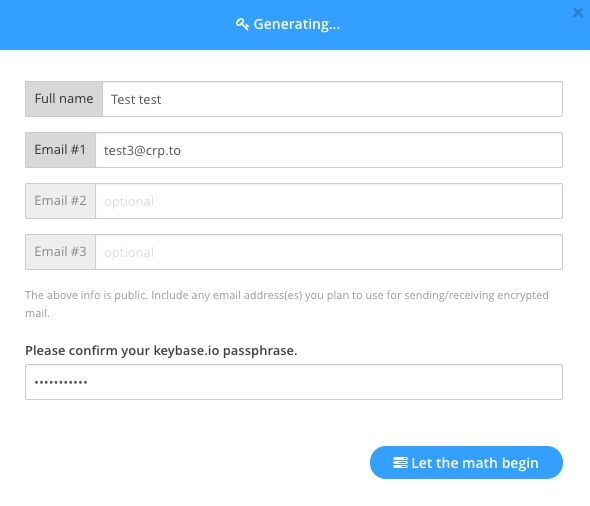

:::callout
**Step 9.** After the key is generated make sure to uncheck Host encrypted private key, too. Best security practices are to only keep your private key offline.
:::

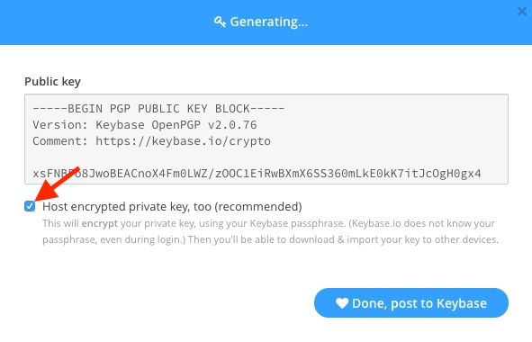

:::callout
**Step 10.** Highlight your private key and copy to a text file. Save this to removable media like a USB flash drive or CD/DVD. You may want to make multiple copies as there is no way to recover this key if you lose it. Also ensure you write down your key passphrase (Same as Keybase account password) this is required to unlock your key. Store both in a physically secure location.
:::

:::tip
A great physically secure location is a safe, preferably a fire safe.
:::

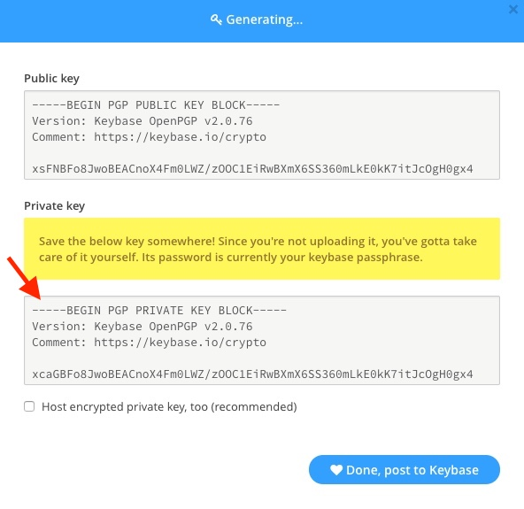

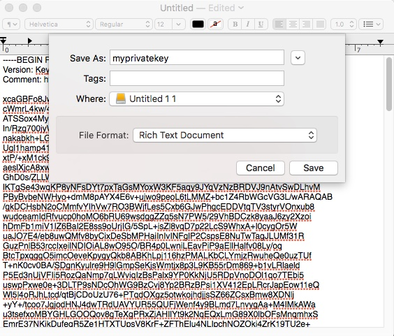

:::callout
**Step 11.** Select Done, post to Keybase.
:::

Now all that is needed to start sending encrypted messages is to load the key you generated onto your OnlyKey.

<i class="fa fa-arrow-down fa-3x"></i> [***Proceed to Loading Keys below***](#loading-keys)


#### Generate OpenPGP Key Using GPG {#generating-keys-gpg}

:::warning
Only generate keys on a computer that you trust (i.e. never a publicly accessible or shared workstation).
:::

:::callout
**Step 1.** Use GPG via terminal to create new OpenPGP key:
:::

```
$ gpg --expert --full-gen-key
gpg (GnuPG) 2.2.20; Copyright (C) 2020 Free Software Foundation, Inc.
This is free software: you are free to change and redistribute it.
There is NO WARRANTY, to the extent permitted by law.

Please select what kind of key you want:
(1) RSA and RSA (default)
(2) DSA and Elgamal
(3) DSA (sign only)
(4) RSA (sign only)
(7) DSA (set your own capabilities)
(8) RSA (set your own capabilities)
(9) ECC and ECC
(10) ECC (sign only)
(11) ECC (set your own capabilities)
(13) Existing key
(14) Existing key from card
```

Your selection? 9

```
Please select which elliptic curve you want:
(1) Curve 25519
(3) NIST P-256
(4) NIST P-384
(5) NIST P-521
(6) Brainpool P-256
(7) Brainpool P-384
(8) Brainpool P-512
(9) secp256k1
```

Your selection? 1

```
Please specify how long the key should be valid.
0 = key does not expire
= key expires in n days
w = key expires in n weeks
m = key expires in n months
y = key expires in n years
```

Enter number of years, i.e. 10 years

```
GnuPG needs to construct a user ID to identify your key.

Real name: Bob Smith
Email address: bob@protonmail.com
Comment:
You selected this USER-ID:
“Bob Smith bob@protonmail.com”
```

Replace Bob Smith with your name and email address

```
Change (N)ame, (C)omment, (E)mail or (O)kay/(Q)uit? o

We need to generate a lot of random bytes. It is a good idea to perform
some other action (type on the keyboard, move the mouse, utilize the
disks) during the prime generation; this gives the random number
generator a better chance to gain enough entropy.
```

Your generated key details should be displayed


:::callout
**Step 2.** Use GPG via terminal to export secret OpenPGP key:
:::

```
$ gpg --output private.asc --armor --export-secret-key <YOUR EMAIL>
```

:::callout
**Step 3.** Follow the instructions [here](#loading-keys) to load private.asc key onto OnlyKey
:::

### Loading Keys {#loading-keys}

:::warning
Only load keys on a computer that you trust (i.e. never a publicly accessible or shared workstation).
:::

:::callout
**Step 1.** Open the text file of your private key that you downloaded in the previous steps in a text editor. Select all of the text of the private key (CTRL+A), and copy the text (CTRL+C).
:::

:::callout
**Step 2.** Click on the Keys tab of the OnlyKey App.
:::

:::callout
**Step 3.** Put the OnlyKey into config mode doing the following
:::

*   Ensure OnlyKey is unlocked
*   Hold the 6 button down for more than 5 seconds, and then release, you will see the light turn off.
*   Re-enter your PIN, you will see the OnlyKey LED flash red while in config mode.

:::callout
**Step 4.** Paste the copied private key into the OpenPGP Private Key (PEM Format) box. Ensure *Auto Load* is selected as Slot, enter the same passphrase you used with Keybase, Protonmail, or GPG. When finished select Save to OnlyKey
:::

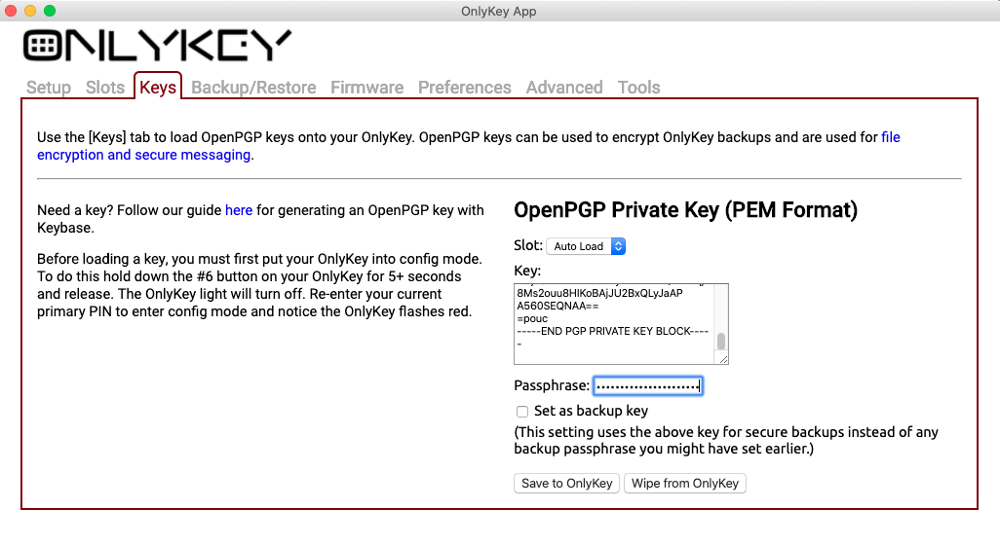

:::note
Selecting set as backup key will use your Keybase key to encrypt backups. Setting this will override any previously set backup passphrase/key as there can only be one backup key set.
:::

You should see a message displayed indicating the key was successfully saved to OnlyKey.

:::tip
If you used Protonmail or Keybase to create your PGP key your OnlyKey is ready to send/receive OpenPGP encrypted messages/files using [WebCrypt](/webcrypt). If not create a Keybase profile -> select 'add a PGP key' -> select 'I have one already' -> paste your public key and upload to Keybase. Alternatively, public key can be pasted to use WebCrypt. <br><br>For using OpenPGP key with GPG get started with [onlykey-agent here](/onlykey-agent).
:::

### Exporting Keys {#exporting-keys}

:::warning
Only export keys on a computer that you trust (i.e. never a publicly accessible or shared workstation).
:::

#### Keybase {#exporting-keys-keybase}

:::callout
**Step 1.** If you do not already have a Keybase account. Follow the instructions in the [Generating Keys guide](#generating-keys) to generate your private key.<br><br>If you already have a Keybase account go to your account and next to your key ID select edit -> Export my private key from Keybase.
:::

:::callout
**Step 2.** Follow the instructions [here](#loading-keys) to load key onto OnlyKey
:::

#### Protonmail {#exporting-keys-protonmail}

:::callout
**Step 1.** Follow the instructions in the [Protonmail knowledge base here](https://protonmail.com/support/knowledge-base/download-public-private-key/) to Download your private key
:::

:::callout
**Step 2.** Follow the instructions [here](#loading-keys) to load key onto OnlyKey
:::

#### Mailvelope {#exporting-keys-mailvelope}

:::callout
**Step 1.** Go to the Mailvelope extension key management tab and select 'export' -> select 'private' -> select 'save'.
:::

:::callout
**Step 2.** Follow the instructions [here](#loading-keys) to load key onto OnlyKey
:::

### Troubleshooting

Some PGP/GPG keys contain legacy settings or values not supported by OpenPGP. These keys are not compatible with OnlyKey. The OnlyKey app uses OpenPGP.js to parse PGP keys, if you experience an error it may be that the PGP key is not compatible with OpenPGP.js. An additional troubleshooting step that can be done is to try importing key in another OpenPGP.js application such as Mailvelope.

#### Loading Keys Advanced {#loading-keys-a}

:::warning
Only load keys on a computer that you trust (i.e. never a publicly accessible or shared workstation).
:::

If you did not generate keys using the [Generating Keys](#generating-keys) steps provided or you already have an OpenPGP key that you would like to use there are some additional considerations.

- OnlyKey supports RSA OpenPGP keys of sizes 2048 and 4096.
- OnlyKey supports ECC OpenPGP keys of type X25519 and NIST256P1
- Decryption operations using a 2048 size key takes about 2 seconds, with 4096 size key it takes about 9 seconds.

For best user experience we recommend using OnlyKey with X25519 or RSA 2048 (subkeys) for decryption and signing.

**What are subkeys?**

Each OpenPGP key is actually multiple keys. There is a primary key and subkey(s), for example when you follow the Generating Keys steps Keybase generates a key that has a 4096 key size primary key and two 2048 key size subkeys. The first subkey is used for decryption and the second subkey is used for signing.

**Why does this matter?**

You need to determine which keys to load to OnlyKey if you are generating your own key. Typically, if your key has two subkeys then subkey 1 is used for decryption and subkey 2 is used for signing.

If your key only has one subkey then the primary (master) key is typically used for signing and the subkey is used for decryption. This is the default for keys created with GnuPG and Mailvelope (OpenPGP.js).

Once you determine which key is used for signing and which key is used for decryption:
- Load the decryption subkey into slot 1 of OnlyKey and check "set as decryption key".
- Load the signing primary/subkey into slot 2 of OnlyKey and check "set as signature key".

**Digging Deeper into PGP**

You can use gpg2 via terminal to check the key flags by using the following commands:
```
$ gpg2 --import /Downloads/asdf_priv.asc
gpg: key 86F9C12A016169E4: public key "asdf <asdf@asdf.com>" imported
gpg: key 86F9C12A016169E4: secret key imported
gpg: Total number processed: 1

$ gpg2 --with-colons --list-keys 86F9C12A016169E4
tru::1:1481922139:0:3:1:5
pub:-:4096:1:86F9C12A016169E4:1513980282:::-:::scESC::::::23::0:
fpr:::::::::37F75C777AEBB46FB690040986F9C12A016169E4:
uid:-::::1513980287::AB20A6F0D2D7FE2A9EFF4575C3FF7ED2DAC66F4A::asdf <asdf@asdf.com>::::::::::0:
sub:-:4096:1:8E6332B693FB6D8F:1513980282::::::e::::::23:
fpr:::::::::F5F80C91796859CEC6CB54768E6332B693FB6D8F:
```
In the shown example the flag 'e' (encryption) indicates that the first subkey is the decryption key. The flag 'sc' indicates that the primary key is the signing key

**Exporting a key from GPG and Loading onto OnlyKey**

:::callout
**Step 1.** Export the OpenPGP compatible private key from GPG
:::
```
$ gpg2 --export-secret-key -a "asdf"
```

:::callout
**Step 2.** Click on the Keys tab of the OnlyKey App.
:::

:::callout
**Step 3.** Put the OnlyKey into config mode doing the following
:::

*   Ensure OnlyKey is unlocked
*   Hold the 6 button down for more than 5 seconds, and then release, you will see the light turn off.
*   Re-enter your PIN, you will see the OnlyKey LED flash red while in config mode.

:::callout
**Step 4.** Copy and paste the private key into the RSA Private Key box. Ensure *slot 1* is selected, the same passphrase you used with GPG is entered as passphrase, *Set as decryption key* is selected. If you wish to use your PGP to encrypt OnlyKey backups select *Set as backup key* (Note: If you previously set a backup passphrase and set this the PGP key will be used instead). When finished select Save to OnlyKey
:::

:::note
Selecting set as backup key will use your GPG key to encrypt backups. If you wish to use a different key for backups just load that key and set it as backup. There can only be one backup key set.
:::

:::callout
**Step 5.** Select the decryption subkey and save
:::

You should see a message displayed indicating the key was successfully saved to OnlyKey.

:::callout
**Step 6.** Paste the copied private key into the RSA Private Key box again. Ensure *slot 2* is selected, the same passphrase you used with GPG is entered as passphrase, and *Set as signature key* is selected. When finished select Save to OnlyKey
:::

:::callout
**Step 5.** Select the signing primary/subkey and save
:::

You should see a message displayed indicating the key was successfully saved to OnlyKey.

**Loading custom GPG private keys onto OnlyKey**

There are many possible configurations for GPG keys some of which may not be parsable in the OnlyKey app. Advanced configurations such as subkeys with different passphrases than the root keys are parsable using the python script [here](https://github.com/trustcrypto/python-onlykey/blob/master/tests/PGPparseprivate.py).


