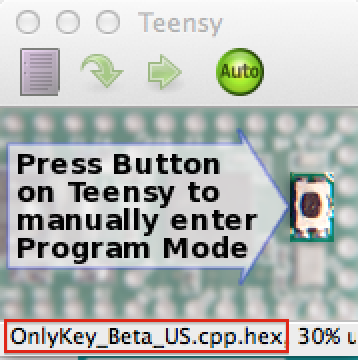
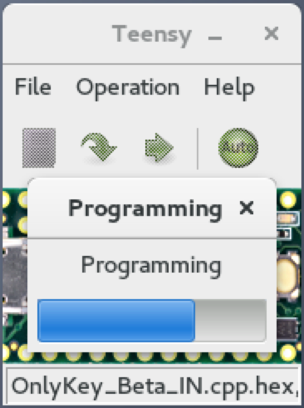
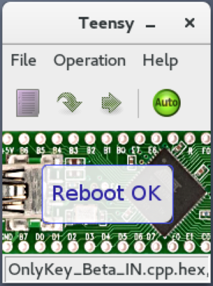

## Overview

This guide is for upgrading legacy OnlyKey devices with firmware version v0.2-beta.6 or earlier only (OnlyKeys purchased prior to Nov 2018). For the current upgrade guide follow the [**Firmware upgrade guide **](/upgradeguide).

## Steps to Upgrade

:::note
If you are a new OnlyKey user just complete steps 2 and 3 below as you won't have anything to backup/restore. Then head over to the [User's Guide](/usersguide#onlykey-setup) to get started.
:::

:::callout
**Step 1.** **Backup OnlyKey** - Create a backup of your OnlyKey by going to the Backup/Restore tab in the OnlyKey app. Ensure you have a copy of your backup key ([User Guide Backup Instructions here](/usersguide#secure-encrypted-backup-anywhere)).
:::

:::callout
**Step 2.** **Upgrade OnlyKey firmware** - Follow instructions [here](#loading-onlykey-firmware) to upgrade firmware on the OnlyKey
:::

:::callout
**Step 3.** **Upgrade OnlyKey desktop app** - Follow instructions [here](#app-desktop) to install the new OnlyKey app.
:::

:::callout
**Step 4.** **Setup OnlyKey** - Follow instructions [here](#onlykey-setup) to setup OnlyKey and restore from backup
:::

:::callout
**Step 4.** **Check out the new features [here](#new-features)**
:::

### Steps to Upgrade OnlyKey firmware {#loading-onlykey-firmware}

**Before Getting Started**

:::warning
Legacy firmware loading wipes all data from OnlyKey. Be sure to have a backup of OnlyKey data and the backup key before loading firmware.
:::

:::callout
**Step 1.**  Insert OnlyKey into USB port
:::
:::callout
**Step 2.**  Download and install [Teensy Loader](https://www.pjrc.com/teensy/loader.html)
:::
:::callout
**Step 3.**  Determine which version of OnlyKey you have and download firmware below
:::

<table>
  <tr>
   <td>OnlyKey Color (Has a square LED)
   </td>
   <td>OnlyKey Original (Has text "LED" visible)
   </td>
  </tr>
  <tr>
   <td>Download OnlyKey Color Standard Edition firmware <a href="https://github.com/trustcrypto/OnlyKey-Firmware/releases/download/v0.2-beta.7/OnlyKey_Beta7_STD_Color.cpp.hex">here</a>
   </td>
   <td>Download OnlyKey Original Standard Edition firmware <a href="https://github.com/trustcrypto/OnlyKey-Firmware/releases/download/v0.2-beta.7/OnlyKey_Beta7_STD_Orignal.cpp.hex">here</a>
   </td>
  </tr>
  <tr>
   <td>Download OnlyKey Color International Travel Edition firmware <a href="https://github.com/trustcrypto/OnlyKey-Firmware/releases/download/v0.2-beta.7/OnlyKey_Beta7_IN_TRVL_Color.cpp.hex">here</a>
   </td>
   <td>Download OnlyKey Original International Travel Edition firmware <a href="https://github.com/trustcrypto/OnlyKey-Firmware/releases/download/v0.2-beta.7/OnlyKey_Beta7_IN_TRVL_Original.cpp.hex">here</a>
   </td>
  </tr>
</table>

:::callout
**Step 4.** You can ensure the integrity of your downloaded firmware by verifying the checksum
:::

<table>
  <tr>
   <td>
File Name
   </td>
   <td>SHA 256 Checksums
   </td>
  </tr>
  <tr>
   <td>OnlyKey_Beta7_STD_Color.cpp.hex
   </td>
   <td>fa2ccd6925fa9e3f72f1d7b40db0c7f33732fe0a8f55fb8a3f315ad9ac05ef87
   </td>
  </tr>
  <tr>
   <td>OnlyKey_Beta7_STD_Original.cpp.hex
   </td>
   <td>356e25e337dad8fe1798592d5c674ddd44fac1340e054df9d43176f7e59406b2
   </td>
  </tr>
  <tr>
   <td>OnlyKey_Beta7_IN_TRVL_Color.cpp.hex
   </td>
   <td>cac81a1d5606c3939c45c5b0ebeab8f9d01c510e20a00123ad35314fc1006754
   </td>
  </tr>
  <tr>
   <td>OnlyKey_Beta7_IN_TRVL_Original.cpp.hex
   </td>
   <td>7467910663f72bf7604be776a381a72d881df5afcc5a0da697aaedbfa315a0f9
   </td>
  </tr>
</table>

:::tip
To do this in Windows open a command prompt and type 'certUtil -hashfile pathToFileToCheck SHA256'. To do this in Linux open a terminal and type 'sha256sum pathToFileToCheck'. Where pathToFileToCheck is replaced with the path of the file you are checking.
:::

:::callout
**Step 5.**  In Teensy Loader select File -> Open HEX File. Then select the firmware you downloaded and click open.
:::
:::callout
**Step 6.**  Now the firmware should appear at the bottom of the Teensy Loader application.
:::

:::note
If a message prompts that 'HEX file is too large' ensure that your OnlyKey is plugged in.
:::

:::callout
**Step 7.**  In order to enable the OnlyKey to upload the new firmware a jumper (Paperclip, aluminum foil etc) must make contact between the two small copper color circles shown while the OnlyKey is plugged into the USB port.
:::

:::tip
If your OnlyKey has a case on it you can just slip the two corners out of the case without completely removing the case.
:::

:::callout
**Step 8.**  With the Teensy Loader in the foreground, you should now see the Teensy Loader progress bar and then a reboot complete appear in the Teensy Loader which indicates that the firmware has loaded successfully.
:::

**Under The Hood** - What actually happens when you load the firmware is that a mass erase is completed first. What this means is that all data is completely wiped, and then the new firmware is loaded.

### Install OnlyKey Desktop App {#app-desktop}

Follow instructions here - [OnlyKey App Install](#onlykey-setup)

### In App Firmware Updates

You may notice now that there is an option in the app to load firmware when setting up a device. There is also a tab named Firmware in the app. This may be used to load the latest firmware onto OnlyKey directly through the app, no backup/restore or wiping is required. Firmware updates are securely signed using a simple blockchain and verified by on the OnlyKey.


