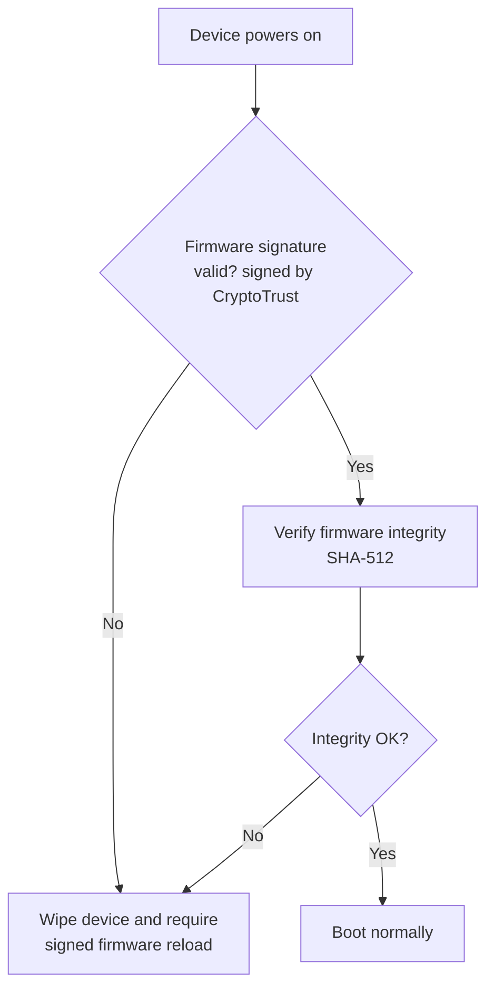
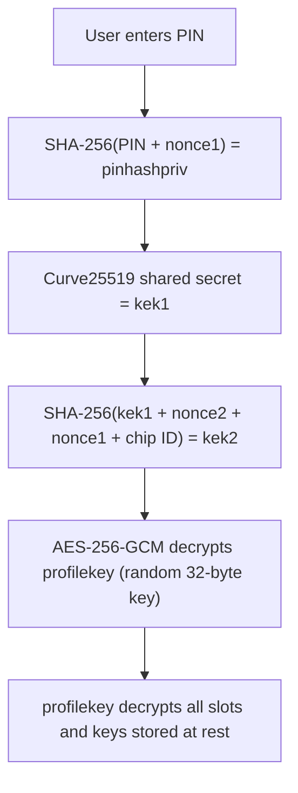

## Security Features Overview

- **Firmware verification** - The bootloader verifies the firmware signature on the OnlyKey. The firmware is only loaded onto the OnlyKey if the firmware is correctly signed by CryptoTrust.

- **Firmware integrity checking** - The bootloader verifies the firmware hash each time the device is used. The device only starts the firmware if the firmware has not changed.

- **Tamper resistant / chemical resistant hardware** - The device is coated with a chemical resistant coating that is    resistant to chemical removal. Visible damage is done to the device by attempting to access coated electronics (Tamper evident).

- **Protected key operations** - Encryption / decryption operations are only allowed after user authentication via PIN.

- **Read/write-protected secure flash** - OnlyKey utilizes Kinetis [flash security](https://www.nxp.com/docs/en/application-note/AN4507.pdf) to securely lock all data residing on OnlyKey.

- **Offline secure processor** - The data stored and processed on the OnlyKey is completely isolated from the connected computer. Data can only be written to the OnlyKey or wiped. Physical user touch is required to authorize authentication.

- **Secure encrypted backup and restore** - Backups are securely encrypted with a user's passphrase (25+ characters) or a user's PGP key.

- **[True random number generation](/security#cryptographically-secure-random-number-generator)** - To guarantee random keys the patent pending method of random number generation utilizes a combination of hardware entropy and user touch entropy. The user touch entropy is completely unpredictable random data that is affected by many variables such as the conductivity of the user's skin, how long they press button, how long they delay between button presses, temperature and humidity.

### About Hardware Security {#hardware-security}

When it comes to hardware security there are terms such as tamper resistant, tamper evident, tamper proof, and secure element. It is important to understand what these terms mean as they are often used for marketing purposes.

- **Tamper proof** - Anyone with in-depth knowledge of hardware security understands there is no such thing as tamper proof. The National Institute of Standards and Technology has established some standards for the SECURITY REQUIREMENTS FOR CRYPTOGRAPHIC MODULES in the publication [here](http://nvlpubs.nist.gov/nistpubs/FIPS/NIST.FIPS.140-2.pdf). This standard defines 4 security levels. A simplified explanation of these levels can be found on [wikipedia](https://en.wikipedia.org/wiki/FIPS_140-2) (Notice that even the highest security level is not tamper proof).

- **Tamper resistant** - This can mean something as simple as the device being coated in plastic. In many cases that plastic can [easily be removed](http://www.hexview.com/~scl/neo/) with household chemicals.

- **FIPS-140-2** - OnlyKey meets many of the requirements of FIPS certification including using FIPS approved algorithms (FIPS 140-2 Level 1 - AES-256). OnlyKey circuitry is coated with a physical protection compound that is both chemical resistant and tamper resistant. This means that it would be difficult to remove and not easily dissolvable with chemicals like plastic coatings. Removal of the coating also results in noticeable damage to the OnlyKey (FIPS 140-2 Level 2 - Tamper Evident).

- **Secure element** - This label indicates that the manufacturer intends for the device to be used for security related applications. This label does not ensure that a device is actually secure. For example, an article [here](https://www.cl.cam.ac.uk/~sps32/cardis2016_sem.pdf) found that when attempting to extract the memory from a device using a scanning electron microscope, the smart card (secure element) was compromised just as the other non-secure elements tested.
– ATMEL AT90SCxx 0.21µm 2T memory cell (smart card type IC)
Additionally, it is important to consider that most security weaknesses are related to issues with the implementation of a secure element. For example, the Ledger hardware wallet was [compromised](https://saleemrashid.com/2018/03/20/breaking-ledger-security-model/) due to their system architecture. Another consideration with secure elements is that an NDA is required by most manufacturers, which requires the device to be closed source and when a vendor discovers a vulnerability the NDA may require that the vulnerability not be publicly disclosed. This sometimes allows vulnerabilities to go unnoticed for years, as was the case with the recent [Infineon RSA key generation vulnerability](https://crocs.fi.muni.cz/public/papers/rsa_ccs17) that affected millions of smart cards and TPMs; "The vulnerability is present in NIST FIPS 140-2 and CC EAL 5+ certified devices since at least the year 2012".

New security issues continue to be identified in closed source security keys and smart cards. Most recently, Google Titan, Yubikey NEO, Feitian, and NXP smart cards (all with the NXP A7005 secure element) suffered a complete security compromise where with physical access an attacker could extract the private key in a matter of hours:
- [New side-channel attack can recover encryption keys from Google Titan security keys](https://www.zdnet.com/article/new-side-channel-attack-can-recover-encryption-keys-from-google-titan-security-keys/)
- [YubiKey Security Advisory and Risks. Check your YubiKeys right now.](https://www.secureworldexpo.com/industry-news/yubikey-security-advisory-risk)
- [Google recalls some Titan security keys after finding Bluetooth vulnerability](https://www.engadget.com/2019/05/15/google-recalls-some-titan-bluetooth-security-keys/)
- [Minerva attack can recover private keys from smart cards, cryptographic libraries](https://www.zdnet.com/article/minerva-attack-can-recover-private-keys-from-smart-cards-cryptographic-libraries/)
- [Gemalto: One Serious Crypto Flaw Has Put Smart Cards To Cloning Risk](https://securitygladiators.com/gemalto-smart-cards/)
- [Trusted platform module security defeated in 30 minutes, no soldering required](https://arstechnica.com/gadgets/2021/08/how-to-go-from-stolen-pc-to-network-intrusion-in-30-minutes/)
- [Pew! Pew! Researcher Uses Laser to Steal Data From a Tiny Chip](https://www.pcmag.com/news/pew-pew-researcher-uses-laser-to-steal-data-from-a-tiny-chip)

### OnlyKey Bug Bounty Program

No secure hardware is perfect, and CryptoTrust believes that working with skilled security researchers across the globe is crucial in identifying weaknesses in any technology. If you believe you've found a security issue in our product, we encourage you to notify us. We welcome working with you to resolve the issue promptly, please reference the [OnlyKey Bug Bounty Program here](https://onlykey.io/pages/onlykey-bug-bounty-program).

## Technical Specifications

### OnlyKey secure element {#secure-element}

- Freescale Kinetis [flash security](https://www.nxp.com/docs/en/application-note/AN4507.pdf)
- Data-at-rest encryption (AES-256 GCM)
- On-boot firmware integrity verification

**Side-channel attack countermeasures**

- System integrity counters (Glitching attack countermeasure)
- Random processor delay intervals (TEMPEST attack countermeasure)
- On-device PIN (Correct PIN required to perform cryptographic functions)

### Encryption and hashing methods

- Data at rest is encrypted via AES-256-GCM
- FIDO2 data is encrypted via AES-256-CBC
- SSH Authentication uses ECC (P256, ed25519) or RSA signing
- OpenPGP/GPG Decryption/Signing uses ECC (P256, X25519) or RSA (2048 or 4096)
- Firmware signing/verification uses NACL
- Firmware integrity verification utilizes SHA-512
- [WebCrypt App](/webcrypt) uses NACL and AES-256-GCM for data in transit and OpenPGP for secure messages
- [Yubico® One-Time Password](/usersguide#Yubico-one-time-password) uses AES-128
- Challenge-response uses HMACSHA1

### Key storage

- Up to 16 ECC keys are supported of type X25519, P256 (NIST), and secp256k1 (Used for Bitcoin)
- Up to 4 RSA keys are supported with key sizes 2048 and 4096 bit keys.

## Security Threats

### Phishing

OnlyKey by design protects user's from phishing. OnlyKey may be used as a security key (FIDO U2F) which has been found to prevent phishing (Google claims note of it's 85,000+ employees were successfully phished when it implemented U2F security keys)

### Brute forcing the OnlyKey PIN

PINs must be 7 - 10 digits long, this means with a 7 digit PIN there are 279,936 possible PIN codes and with a 10 digit PIN there are 60,466,176 possible PIN codes. After 10 failed PIN attempts the device wipes all data which makes brute forcing of the PIN impossible.

### Stealing the user's computer

OnlyKey stores all sensitive data on the key itself so loss of a computer would not result in loss of this sensitive data.

### Malware on the user's computer

OnlyKey stores all sensitive data on the key itself and malware is not able to extract this data. Sensitive data such as passwords are only entered onto the computer when a physical person presses the assigned button. Additionally, using OnlyKey as a security key (FIDO U2F) provides an additional layer of protection.

### Hacking OnlyKey servers

OnlyKey is a decentralized security key meaning that all sensitive data is stored on the key itself and there are no servers hosting this data.

### Compromising OnlyKey backup files

OnlyKey backup files are encrypted and without the passphrase or PGP key they cannot be decrypted.

### Reflashing the OnlyKey with malicious firmware

OnlyKey may only load firmware signed by CryptoTrust LLC. Firmware integrity is also verified every time the device boots; if verification fails the device is wiped and signed firmware must be reloaded.

### Hardware attacks

There are multiple protections in use to prevent successful hardware attacks.

- All sensitive data is encrypted on OnlyKey and only decrypted after a correct PIN is entered. The decryption key is not stored on the hardware it is derived from the user's PIN and other data including a random nonce.

- While locked and prior to successful PIN entry the device does not allow USB communication and does not read or process USB data.

- While unlocked after a successful PIN entry there is an integrity counter used by the firmware running on OnlyKey. If instructions are skipped over the integrity counter will become corrupt causing the device to restart and lock.

- [Kinetis flash security](https://www.nxp.com/docs/en/application-note/AN4507.pdf) is enabled the first time the device is used. This disables all debugging capabilities of the hardware, securely locks the flash memory, and keeps all information stored within the processor secure.

- Signed firmware uses a block chain where each block is signed and each block is verified on the device itself prior to loading. If any of the blocks of firmware contain an invalid signature the firmware load will be unsuccessful. If any of the blocks of firmware do not contain the valid signature of the previous block the firmware load will be unsuccessful. This ensures that only firmware signed by CryptoTrust LLC may be loaded and the firmware is verified by the device itself.

- Firmware is checked for integrity each time the device is powered on prior to loading the firmware. The device only starts the firmware if the firmware has not changed.

## Supply Chain

### Where is OnlyKey made?

OnlyKey is made in USA of U.S. and imported parts. As with most electronics, OnlyKey consists of a printed circuit board (PCB) and various electronic components. Everything is assembled in the USA.

- The first step in making an OnlyKey is the PCB, this component is essentially the board that the electronics are put onto. This is manufactured in China.

- Next, the PCB and various electronic components are assembled, the components are soldered onto the PCB. This is done in Massachusetts, USA.

- Next, the assembled boards are sent to North Carolina, USA. for programming and application of the tamper resistant coating.

- Finally, the completed OnlyKeys are packaged in North Carolina and sent to distributors like Amazon US and Amazon EU.

## Software Development Security {#software-security}

### OnlyKey Apps {#software-app-security}

OnlyKey software is developed by a small team of trusted developers located in the USA. No 3rd party access to OnlyKey software is granted. OnlyKey apps include the OnlyKey Desktop App, OnlyKey WebCrypt, OnlyKey SSH/GPG Agent, and the OnlyKey CLI. OnlyKey Apps are developed with specific requirements in mind.

- **1 - Privacy** - No logins or tracking of users.
- **2 - Leave encryption to the hardware** - Private key operations and software do not mix. Private keys are kept offline in OnlyKey hardware. For example, WebCrypt and OnlyKey SSH agent have access to only public keys and communicate with OnlyKey for all private key operations.
- **3 - Open source & audit-able** - What you see is what you get, source available on Github.

### OnlyKey Firmware {#software-firmware-security}

OnlyKey firmware is developed by a small team of trusted developers located in the USA. OnlyKey firmware is developed with specific requirements in mind, as OnlyKey is an embedded hardware device these requirements are different than traditional software development.

- **1 - Defense in depth architecture** - This includes designing multiple levels of protection ensuring there is no single point of failure. An example of this is the use of flash hardware security, encrypting sensitive data at rest, and key splitting. Key splitting involves splitting values used to derive private key in physically separate parts of the hardware such as ROM, Flash memory, and EEPROM.
- **2 - Least privilege** - In order to perform privileged tasks such as key loading a user must activate config mode by providing physical user presence and authentication with PIN.
- **3 - Simplicity** - Use of complex data structures may introduce unintended vulnerabilities. For this reason, OnlyKey firmware uses primarily simple buffers to provide simple and auditable code.

## Advanced

### About Differences Between OnlyKey and OnlyKey DUO {#about-differences-between-onlykey-and-onlykey-duo}

1) With OnlyKey the PIN is entered on device only, with DUO it can be entered on device in a non-trusted setting but since the device only has three buttons to enter a 4,5,6 you have to long hold 1,2,3. For this reason the preferred way to enter the PIN for DUO in a trusted setting is to use the OnlyKey app to enter the PIN.

2) With OnlyKey you have 24 slots, the first 12 slots are accessible with primary profile PIN, the second 12 slots are accessible with secondary profile PIN. DUO has all 24 slots accessible with one PIN.

3) DUO does not require a PIN (easier to use) without a PIN it is similar to Yubikey and can be used for either a static password, or MFA (not both since there is no physical PIN protection). If you try to set both in the app on a device with no PIN the device will return an error. 

4) Since the DUO has only three buttons, some of the button definitions are different which can be found [here](/features#button-definitions).

Both OnlyKey and OnlyKey DUO use the same hardware and firmware. 

### About OnlyKey PIN, profiles, key derivation, and encryption

At a high level data at rest is encrypted via AES-256 using a random key that is encrypted by a key encryption key (kek). There is a lot going on to make this happen at a low level and this section is intended to highlight the unique features and methods used to encrypt data at rest.

The following steps occur during initial setup to generate the key used to encrypt data at rest:

1) During OnlyKey startup the bootloader generates a hash of the current firmware, this hash is checked against a stored SHA-512 hash. The firmware is loaded only if the hashes match.

2) Once the firmware is loaded a check is completed to ensure the flash is locked (Flash Security, this occurs during the first boot which is when the device is programmed during manufacturing).

3) During initial setup, a PIN is set on the primary profile. During PIN set the following occurs:
- A 32 byte random number (nonce1) is stored in locked flash
- A 32 byte random number (nonce2) is stored in locked eeprom (hardware wear leveled flash)
- A SHA256 hash (pinhashpriv) of the user's PIN and nonce1 is generated
- A Curve25519 public key (pinhashpub) of pinhashpriv is generated
- If there is only one profile a Curve25519 shared secret of pinhashpriv and pinhashpub is generated (kek1)
- If there are two profiles a Curve25519 shared secret of pinhashpriv and pinhashpub2 is generated (kek1)
- A SHA256 hash (kek2) of kek1, nonce2, nonce1, and a 16 byte ID (Freescale chip ID stored in ROM) is generated
- If there is not already a pinhashpub saved (initial setup), a 32 byte random number is generated (profilekey)
- The profilekey is encrypted via AES-256 GCM using kek2 as the key-encryption-key and Freescale chip ID as IV
- The encrypted profilekey is stored in locked flash
- The public keys pinhashpub and pinhashpub2 (if 2nd profile) are stored in locked flash

All sensitive data on OnlyKey is encrypted with this AES-256 profilekey and IVs change based on the slot/type of data being encrypted.

The high-level key-derivation chain looks like this:

Because the decryption key is derived from the PIN plus random values held in separate locked hardware (nonce1 in flash, nonce2 in EEPROM, chip ID in ROM), the data cannot be decrypted without both the correct PIN and the original device.

- A random 32 byte number is generated, this is the default ECC key used for key derivation
- This ECC key is stored in ECC key slot 32
- The derivation key is not used directly, it is used to derive other keys for things like the OnlyKey SSH agent

4) Once PINs have been set PIN authentication is required to unlock OnlyKey. During PIN authentication the following occurs:
- A SHA256 hash (pinhashpriv) of the guessed PIN and nonce1 is generated
- A Curve25519 public key (guesedpinhashpub) of pinhashpriv is generated
- A SHA256 hash (maskedpublicguessed) of nonce2(16 bytes), Freescale chip ID (2nd 16 bytes), and guesedpinhashpub is generated
- A SHA256 hash (maskedpublicstored) of nonce2(16 bytes), Freescale chip ID (2nd 16 bytes), and storedpinhashpub is generated
- This is repeated for profile 2 if there are 2 profiles

The two hashes, maskedpublicguessed and maskedpublicstored are compared, if they match the guessed PIN is correct and the follow occurs:
- If there is only one profile a Curve25519 shared secret of pinhashpriv and pinhashpub is generated (kek1)
- If there are two profiles a Curve25519 shared secret of pinhashpriv and pinhashpub2 is generated (kek1)
- A SHA256 hash (kek2) of kek1, nonce2, nonce1, and a 16 byte ID (Freescale chip ID stored in ROM) is generated
- The profilekey is decrypted via AES-256 GCM using kek2 as the key-encryption-key and Freescale chip ID as IV

**PIN Changes**
During PIN changes the profilekey remains static but is re-encrypted with a new key-encryption-key. A new kek2 is generated based on user's new PIN and a newly generated 32 byte random number nonce2.

### How does OnlyKey encrypt backup data {#how-backup}

Backups may only occur if a backup key/passphrase is set. Without setting a backup key/passphrase attempting to backup will only print instructions for how to set a backup key/passphrase. A backup key/passphrase may only be set during initial setup or if the device is in [config mode](#config-mode). There is also an option to lock backup key which ensures that the backup key may not be changed on a device. Enabling this option where there is no backup key permanently disables the backup feature until a factory default occurs.

When a backup key/passphrase is set, the OnlyKey is unlocked, and a backup is initiated by user presence on the OnlyKey the following occurs:
- OnlyKey retrieves records to backup and compiles them all into a buffer
- Once all records are retrieved the buffer is encrypted via AES-256 GCM
- If the backup key is an ECC key the AES-256 encryption key is derived as follows:
-- A shared secret (sec1) of the ECC private and public keys (pub1) is generated (This ECC key may be Curve25519, secp256r1, or secp256k1)
-- A random IV (iv) of 12 bytes is generated
-- A SHA256 hash (sec2) of sec1, pub1, and iv is generated
- The data in the buffer is then encrypted via AES-256 GCM with the key sec2 and the IV
- The IV is appended to the end of the encrypted buffer

- If the backup key is an RSA key the AES-256 encryption key is derived as follows:
-- A random 32 byte number is generated as the AES-256 key
-- The AES-256 key is encrypted via mbedtls_rsa_rsaes_pkcs1_v15_encrypt (RSA key size 2048 - 4096)
- The data in the buffer is then encrypted via the random AES-256 GCM key
- The pkcs1_v15 output is appended to the end of the encrypted buffer

- The encrypted data is then converted to base64 format and typed out via the keyboard into a text box where it may be saved as a text file.

-----BEGIN ONLYKEY BACKUP-----

base64 encrypted data

-----END ONLYKEY BACKUP-----

### Cryptographically Secure Random Number Generator {#cryptographically-secure-random-number-generator}

After much research it was concluded that Arduino and other microcontrollers such as MK20 are not ideal for generating truly random numbers. While the Arduino Reference Manual recommends using analog pins, which read random atmospheric noise to seed a PRNG, it was concluded that this method alone may not generate a cryptographically secure random number. The paper here goes into more detail - [http://benedikt.sudo.is/ardrand.pdf](http://benedikt.sudo.is/ardrand.pdf). A true random number generator uses non-deterministic sources to produce randomness. Thus, the random number generation function in use requires user provided entropy. This is similar to how TrueCrypt/VeraCrypt use mouse movements to generate entropy during key generation. The OnlyKey RNG function uses a combination of the entropy provided from the following sources:

- Two separate analog pins (atmospheric noise)
- One temperature sensor (temperature changes from environment, user's touch, and attached computer)
- User's key presses on the six capacitive touch sensors (conductivity of user's skin, duration of key press, number of key presses, conductivity of air)

Below is an example of values read from the analog 0 pin and the touch pin values, read once per second for 3 seconds without any user provided entropy.

Analog 0 Value = 123

Touchpin 1 Value = 552

Touchpin 2 Value = 553

Touchpin 3 Value = 607

Touchpin 4 Value = 700

Touchpin 5 Value = 662

Touchpin 6 Value = 723

Analog 0 Value = 87

Touchpin 1 Value = 553

Touchpin 2 Value = 555

Touchpin 3 Value = 610

Touchpin 4 Value = 700

Touchpin 5 Value = 663

Touchpin 6 Value = 724

Analog 0 Value = 242

Touchpin 1 Value = 552

Touchpin 2 Value = 553

Touchpin 3 Value = 605

Touchpin 4 Value = 699

Touchpin 5 Value = 662

Touchpin 6 Value = 723

Without any interaction from the user there is entropy generated from analog 0 and some entropy generated from the touch pins. The touch pin's values change slightly based on temperature, humidity, and no two pins have exactly the same sensing calibration. Below is an example of values read from the analog 0 pin and the touch pins, values read once per second for 3 seconds with user entering a three digit PIN.

Analog 0 Value = 221

Touchpin 1 Value = 551

Touchpin 2 Value = 559

Touchpin 3 Value = 6452

Touchpin 4 Value = 700

Touchpin 5 Value = 662

Touchpin 6 Value = 709

Analog 0 Value = 84

Touchpin 1 Value = 550

Touchpin 2 Value = 559

Touchpin 3 Value = 611

Touchpin 4 Value = 712

Touchpin 5 Value = 5684

Touchpin 6 Value = 729

Analog 0 Value = 130

Touchpin 1 Value = 550

Touchpin 2 Value = 553

Touchpin 3 Value = 609

Touchpin 4 Value = 6228

Touchpin 5 Value = 669

Touchpin 6 Value = 721

With user interaction, the touch pin values change significantly. Also the touch pins next to the button that was pressed change slightly just from the proximity of a user's finger to that button. As implemented, touch pin values are read from all six capacitive touch sensors once every ~10ms and users are required to have a PIN of 7 – 10 digits. During a typical login (One button press per second), this generates approximately 56 - 80 numbers based on the conductivity of a user's skin and 280 - 400 numbers based on the conductivity of the air around the buttons not being pressed. By performing xor and bitshift operations on these numbers we can generate a random number that is based on non-deterministic values that are completely unpredictable. Additionally, if a user enters an incorrect PIN this would generate even more entropy as this would require re-entering the PIN and during use the buttons are also pressed to select sites to authenticate to which generates constantly unpredictable entropy.

#### Config Mode {#config-mode}

Putting a device in config mode is required to configure certain things like PGP keys and some preferences:

This secondary feature has been added to provide additional protection against the following scenario:

Bob leaves his OnlyKey unlocked and plugged into his computer and walks away, Alice walks up and loads her key onto Bob's OnlyKey and sets this as the backup key and then uses this to create a backup. Alice now has the encrypted contents of Bob's OnlyKey and knows the key.

While Bob should not have left his device unlocked and unattended we still want to prevent this threat model so first a device must be in config mode to load keys or to restore from backup. To put a device in config mode hold the # 6 button down for 5 seconds on an unlocked OnlyKey, then re-enter the PIN. This ensures that only someone who knows the PIN can select the private key used to create a backup.

Additional security may be added with the backup key mode mentioned below.

#### Backup Key Mode {#backup-key-mode}

There is also an option to lock the backup key which ensures that the backup key may not be changed on a device. Enabling this option where there is no backup key permanently disables the backup feature until a factory default occurs.

