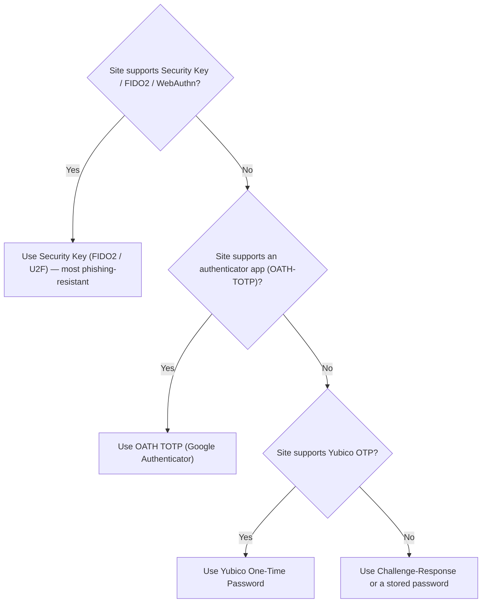
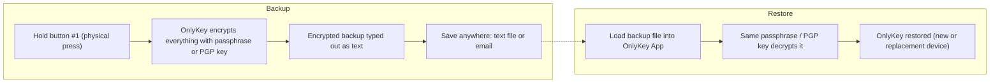

## Start Here - Unpacking OnlyKey {#unpacking}

::: steps
1. Remove the OnlyKey and the metal quick-connect keychain from packaging.

   
2. Attach the quick-connect to the OnlyKey; the other end of the quick-connect can be attached to your keyring.
3. (Optional) Check out OnlyKey accessories — [color cases](https://onlykey.io/products/onlykey-silicone-case?variant=469636644908), [mobile adapter (USB-C, Lightning)](https://onlykey.io/collections/accessories-1), [business workstation](https://onlykey.io/collections/workstation).
:::

***Proceed to setup below***

## Setting up OnlyKey {#initial-setup}

[OnlyKey Setup Using OnlyKey App](#app-desktop) (App install required, 5-10 minute setup time)

Prefer a how-to video? Watch one [here](https://vimeo.com/967163806) that demonstrates setting up a new OnlyKey

::: embed https://vimeo.com/967163806

### OnlyKey Quick Setup {#quick-setup}

:::warning "⚠️ Warning"
Quick setup is an alternative way to set up a new OnlyKey with no apps required. However, a computer with a US layout keyboard is required and to take advantage of many of the OnlyKey features the OnlyKey app is required.
:::

:::tip "💡 Pro Tip"
Prefer a how-to video? Watch one [here](https://vimeo.com/372991865) that demonstrates setting up a new OnlyKey with Quick Setup

::: embed https://vimeo.com/372991865

:::

To complete OnlyKey quick setup follow the instructions below:

- Open a text editor such as Notepad (Windows) or TextEdit (Mac) on a trusted computer
- Click inside the text editor
- Insert OnlyKey into the USB port on your computer
- Hold button #3 on your OnlyKey down for 5+ seconds and then release

:::callout
OnlyKey will type out instructions for you to follow into the text editor. Follow these instructions to set PINs on OnlyKey and a backup passphrase. You can choose to have OnlyKey automatically generate random PINs or set PINs yourself. When setting a PIN keep in mind that remembering a pattern may be easier than remembering numbers.
:::

- When you are complete the quick setup you will see the text 'SETUP COMPLETE, DELETE THIS TEXT'
- Make sure you have carefully written down your PINs and backup passphrase and store this in a secure location
- When finished enter your PIN onto OnlyKey to start using your new device, OnlyKey is ready for use as a security key (FIDO2/U2F) and for challenge-response

 ***To use OnlyKey for password management, file encryption, and other two factor authentication methods use the steps below to install the OnlyKey app***.

### Install OnlyKey Desktop App {#app-desktop}

:::callout
**Step 1.** Download installer
:::

::: tabs
== tab macOS
[**Download for macOS**](https://github.com/trustcrypto/OnlyKey-App/releases/download/v5.3.6/OnlyKey.App.5.3.6.dmg)
== tab Windows
[**Download for Windows**](https://github.com/trustcrypto/OnlyKey-App/releases/download/v5.3.6/OnlyKey_5.3.6.exe)
== tab Linux
[**Download for Linux**](https://github.com/trustcrypto/OnlyKey-App/releases/download/v5.5.0/OnlyKey_5.5.0_amd64.deb)

If a UDEV rule has not been created previously, follow the instructions [here](/linux). The OnlyKey app may also be installed via snapcraft - [Linux Guide](/linux).
== tab Chrome OS / Chrome App
See the [OnlyKey Chrome App](/app#onlykey-chrome-app) section.
:::

:::callout
**Step 2.** Install and launch the app.
:::

:::tip "💡 Pro Tip"
You can ensure the integrity of your downloaded file by verifying the checksum. <br>macOS SHA 256 CHECKSUM: 1f7756227af0752bf2d1071bf6f04e5a3282df54ac0125fdfb4abfab7edb115a<br>Windows SHA 256 CHECKSUM: 22fc0b80d0b11fa5b0f9a566ae11edb8aee41e53905259e2a8a948c71e45e1fe<br>Linux SHA 256 CHECKSUM: f00f056a3432d624a805596a6c6b0f2ce5d8efa8c95da1baac39599946301065<br> [ **Linux App GPG Public Key**](https://github.com/trustcrypto/OnlyKey-App/releases/download/v5.3.0/CryptoTrust_LLC_pub.asc) A1D6 4A3B 496C B0F3 6E12 B46F 9A9F 520D 44EA 53D1
:::

:::tip "💡 Pro Tip"
As you use the OnlyKey app you can hover over icons for tooltips and click on icon's to browse to that topic in the documentation 
:::

***Proceed to OnlyKey setup below***

### OnlyKey Setup Using OnlyKey App {#onlykey-setup}

If you have already setup OnlyKey using quick setup proceed to [Account Setup](#account-setup)

::: steps
1. Insert OnlyKey and select [Next] to get started.

   

   *Before setting a PIN: you may find it easier to remember a pattern rather than a 7–10 digit PIN, similar to the patterns used to unlock a phone lock screen.*

   
2. Enter a PIN code on the OnlyKey Keypad, check the disclaimer box, and select [Next].

   
3. Re-enter PIN code, and select [Next].
4. Enter a PIN code for second profile, check the disclaimer box, and select [Next].

   
5. If you wish to set a self-destruct PIN, enter a PIN code, check the disclaimer box, and select [Next].

   
6. Re-enter PIN code, and select [Next].
7. Follow the instructions to enter a Backup Passphrase and select [Next].

   
8. If you have an OnlyKey backup to restore, select [Choose File], select your OnlyKey backup file, and then select [Next] to load it onto your OnlyKey. If you do not have a backup, just select [Next] to complete the setup.

   
:::

Your device is now set up and will automatically reboot. You will be prompted to enter your PIN from now on when using the OnlyKey.

## Reset/Factory Default Device {#reset-default}

If you ever need to wipe and restore your OnlyKey DUO to factory defaults you can do that by entering 10 incorrect PINs. You will notice that after entering 3 incorrect PINs your OnlyKey is steadily blinking red. This is an intentional safeguard so that your OnlyKey will not be inadvertently wiped by repeatedly pressing buttons. You must remove and reinsert your OnlyKey and enter 3 more incorrect PINs. Repeat this until 10 incorrect PINs have been entered. The device will then have a solid green light on that indicates that it is ready to set up

You can also use the Self-destruct PIN if one has been set.

***Proceed to setup accounts below***

## Setting up accounts {#account-setup}

:::tip "💡 Pro Tip"
Set aside some time to set up accounts as this can be time consuming the first time you set it up. After you configure your profiles once you won't have to do this again unless you add a new account. Think of all the time you will save not having to remember and type usernames, passwords, and getting your phone out to type codes etc. This is a huge time saver in the long run.<br><br>
Prefer a how-to video? Watch one [here](https://vimeo.com/372894554) that demonstrates setting up a new OnlyKey

::: embed https://vimeo.com/372894554

:::

### Configure Basic Login Info {#all-about-slots}

:::callout
**Enter your PIN -**  After setup you are prompted to enter the PIN you set onto your OnlyKey six button keypad.
:::

Now that your OnlyKey is unlocked you see this screen.


#### All About Slots {#all-about-slots}

The Slots area of the application is where you will set up things like your usernames, passwords, and 2 factor. As you can see the word ''empty'' is shown 12 times next to a button with a number and a letter. Each of these buttons refer to one of the slots on your OnlyKey.

**What are slots?** On the OnlyKey you have 6 buttons and 12 available slots in each profile. Each slot can be set with a Label, URL, Username, Password, and two-factor authentication. Each slot is assigned to a button on your OnlyKey. So for example if you were to save your Google password to slot 1a, then to type out your Google password you would tap button 1 on your OnlyKey for less than one second (Slot 1a). If you were to save your Yahoo password to slot 1b, then to type out your Yahoo password you would hold button 1 on your OnlyKey for more than one second (Slot 1b).

Each button has two slots assigned to it that can be activated by holding the button for less than or more than one second.

The slots that have not been configured have no label so they are shown as ''empty''. Next, let's set a label to slot 1a.

#### Set a Label {#set-a-label}

::: steps
1. Click the 1a button in the OnlyKey app and see the Slot 1a Configuration
2. Enter a label such as Gmail in the Label field, check the box next to Label, and click Submit.

   
:::

*Now the label you entered is assigned to slot 1a. Slot labels are helpful if you forget which button is assigned to which account you can open the OnlyKey app at any time to see how it is set up.*


#### OnlyKey On-The-Go {#otg}

**What if I am using a computer without the OnlyKey app?**

Open a text editor and then hold down the 2 button on OnlyKey for 5+ seconds. OnlyKey will type out your slot labels which may look something like this:

1a Google<br>
2a Bank<br>
3a Email<br>
4a VPN<br>
5a School<br>
6a U2F<br>
1b Amazon<br>
2b Dropbox<br>
3b<br>
4b<br>
5b<br>
6b Lastpass<br>

Since OnlyKey types out this information this method works on all computers and even mobile devices.

Another low tech option is to write your labels on a card/paper and carry this in your wallet.

:::warning "⚠️ Warning"
Obviously, no sensitive information should be written on card/paper or saved to your slot labels. Just something that helps you remember which account is assigned to which button.
:::

Find out more about [mobile support on-the-go](#android-support)?

Find out more about [TOTP support on-the-go](#google-authenticator-otg)?

**Next, let's assign a password to slot 1a.**

#### Set up a Slot (Basic Login) {#set-up-a-slot}

The example configuration shown below would be to set OnlyKey to store our Google account password. 

::: steps
1. Click the 1a button in the OnlyKey app, click the checkboxes and enter values as shown:

   
2. Click submit to save the configuration to OnlyKey:

   **Now the configuration is saved and shows up in the OnlyKey app as ''Google 1''**
   
3. Now to log in we browse to Google login page, if prompted we type our Gmail address and select Next. When presented with the password field we press button #1 on OnlyKey to output the password into the password field.

   
:::

:::note
Since not all Login pages are the same OnlyKey has options like tab (use to go to the next field) and Return (submit). These essentially press either the tab or return key so if you are unsure of how to set up your OnlyKey configuration try logging into your login page first by using just your keyboard. For the example above you would do this by entering your username, pressing the Return/Enter key, on the next page entering your password and then pressing the Return/Enter key to complete your login.<br><br>Before testing a configuration in your web browser it is a good idea to try it out in a text editor like notepad, just to make sure it looks right. The last thing you want is to find that you accidentally are typing your password out in the wrong field and now have to change the password.
:::

**Next, let's assign a username and password to slot 1b.**

The example configuration shown below would be to set OnlyKey to store our Dropbox username and password. 

::: steps
1. Click the 1b button in the OnlyKey app, click the checkboxes and enter values as shown:

   
2. Click submit to save the configuration to OnlyKey:

   **Now the configuration is saved and shows up in the OnlyKey app as ''Dropbox''**
   
3. Now to log in we browse to Dropbox login page, click on the username field and hold button #1 (for more than one second) on OnlyKey to output the username and password into the login field.

   
:::

#### Set up a Slot (Advanced Login) {#set-up-a-slot-advanced}

While Basic Login covers many login pages there are lots of custom login pages and OnlyKey has features to match those custom login scenerios.

If you need OnlyKey to fill a custom login form that does not fit into the basic login format i.e. You need to perform the following:<br>
- Enter the Username<br>
- Press RETURN<br>
- Wait for website to load next page
- Enter the password<br>
- Press RETURN<br>
<br>

Delays may be set to allow for the web page to load.

::: steps
1. Click the 2a button in the OnlyKey app, select the Full Configuration (Advanced) tab, click the checkboxes and enter values as shown:

   
2. Click submit to save the configuration to OnlyKey:

   **Now the configuration is saved and shows up in the OnlyKey app as ''Custom Login'**
   
3. Now to log in we browse to custom login page, click on the username field and press button #2 on OnlyKey to output the username and press RETURN. OnlyKey then waits 3 seconds for the page to load before entering password into the password field.
:::

While the Advanced Login options cover the majority of login scenerios there still may be some that don't fit the template. If you need OnlyKey to fill a custom login form that does not fit into the template i.e. You need to perform the following:<br>
- Enter the Username<br>
- Press TAB<br>
- Press RETURN<br>
- Wait for website to load next page
- Enter the password<br>
- Press TAB<br>
- Press RETURN<br>
<br>
You can enter ' \t' or ' \r' inline with slot data to type the extra TAB or RETURN and ' \d3' to DELAY 3 seconds. <br>


Where in the username field the value is set to:<br>
```
onlykey \t  \r  \d3 
```
Where in the password field the value is set to:<br>
```
password \t  \r 
```

<br>
You can chain together multiple ' \t' or ' \r' in the fields.  Its one space to start and one space to end so if your chaining together multiple tabs it would have a double space in between like:
```
{space} {\} {t} {space} {space} {\} {t} {space} {password} {space} {\} {r}
```
To do even more like press special keys such as Ctrl-Alt-Del OnlyKey has a special mode that enables filling virtually any form or login. See [Sysadmin Mode](#sysadmin-mode) for more details.

Additionally, by using the URL field in Full Configuration (Advanced) we can have the OnlyKey type the login page URL into the browser and browse to the login page. This way a one-touch login is possible. Just select the empty URL field in the browser and the URL is automatically typed out and Return is pressed to browse to the site. Once on the site loads the password is entered and the login is complete.

:::tip "💡 Pro Tip"
Using the URL field provides protection against spear phishing attacks as this provides assurance that the site you are entering your password into is the legitimate site. For example, if you receive an email asking you to log into your account to verify something instead of clicking the link in the email to login you would use OnlyKey to browse to the correct site to login.
<br>
*Need a URL longer than 56 characters? Try using a URL shortner like Bit.ly*
:::

**The example configuration shown below would be to set up a URL and password to automatically login to the Google page shown below. Notice that the username is already remembered by the website, so there is not a need to set this in the OnlyKey slot.**


#### Test a Slot {#test-a-slot}

Once you set your desired account information to a slot then try it out by going to the login page, clicking in the login field, and pressing the corresponding button on the OnlyKey.

***Common issues:***

*   ***The password is entered before page loads.***
    *   *Set the delay, usually 2-3 seconds works well but this may not be enough time for slow web pages or slow internet connections.*
*   ***There is a Captcha required sometimes after password***
    *   *You can either set the delay to a high value like 9 seconds to give yourself time to enter this or select None. Selecting None means that the password is entered but not submitted so you have time to enter additional information.*
*   ***Everything works fine but I really wish it typed faster.***
    *   *You can adjust the type speed in [preferences.](#configurable-keyboard-type-speed)*

**These examples illustrate how to use OnlyKey in two real world scenarios. A key takeaway here is that you can configure OnlyKey to automatically do what you would normally do manually. Any combination of the fields shown in the slot configuration may be used or not used to fit login format.**

<br>
*The table below shows how to configure some common login forms that at first may seem problematic.*
<br>

<table>
  <tr>
   <td><strong>Login Format</strong>
   </td>
   <td><strong>Configuration</strong>
   </td>
  </tr>
  <tr>
   <td>Site that does not automatically select username field after loading page (i.e.Kracken).

   </td>
   <td><em>With URL - You will notice that "Tab before UserName" is checked. This will select the username field as it is not automatically selected when the page loads.</em>

<em>Without URL - Browse to the login page first and place cursor in the username field before selecting the assigned OnlyKey button.</em>

   </td>
  </tr>
  <tr>
   <td>Site where username is remembered after first login (i.e. Google).
   </td>
   <td><em>Password and 2FA only - This is usually the best option if you remember your username/email address as this will work on any computer whether your username is remembered or not. This method does not include URL in case you are prompted for a password.</em>

<em>Username Remembered w/URL - If you use your device mostly on a computer where you username is remembered this is a good option. If you use this configuration on a computer where username is not remembered then you must output of the login information into notepad and paste into login fields.</em>

   </td>
  </tr>
  <tr>
   <td>Site that does not automatically select OTP code field (i.e. Salesforce)

After loading next page

   </td>
   <td><em>You will notice that "Tab before OTP" is checked. This will select the OTP field as it is not automatically selected when the page loads.</em>

   </td>
  </tr>
  <tr>
   <td>Site where username and password is required first and then OTP code field appears below (i.e. IT Glue)

   </td>
   <td>

   </td>
  </tr>
</table>

:::warning "⚠️ Warning"
***NO WEAK PASSWORDS*** - While OnlyKey makes it possible for your accounts to be more secure than remembering passwords or than using a software password manager one thing to remember is that it is up to you to use strong passwords. If you set your password to something like ''Summer2021!'' this is not secure, in fact we recommend using randomly generated strong passwords that cannot be guessed or cracked by a hacker.
:::

Generating a strong password is easy to do. Next, let's use two different methods to generate strong uncrackable passwords.

#### Generate Strong Passwords Online {#generate-strong-passwords-online}

There are many websites that allow you to generate a secure random password and there are also tools built into many software password managers.

- Password manager built into [KeePassXC](#keepassxc)
- Bitwarden password generation tool available [here](https://bitwarden.com/password-generator/)
- 1password password generation tool available [here](https://1password.com/password-generator/)
- LastPass password generation tool available [here](https://lastpass.com/generatepassword.php)


#### Generate Strong Password via Browser Extension {#generate-strong-password-via-browser-extension}

Install a browser extension by selecting add to Chrome the same way that you installed the OnlyKey app.

Chrome Extension available from the Chrome Web Store [here](https://chrome.google.com/webstore/detail/strong-password-generator/emehklffcaphknhhfhadkjhpfapcbpco).


**Next, let's assign a OATH-TOTP secret for MFA**

### Configure Two Factor Authentication (2FA) {#two-factor-authentication-2fa}

Two-factor authentication (2FA) is essentially an extra step that is required during the login process that makes it so that even if your username and password are compromised an attacker cannot login to your account. It is called two-factor authentication, or sometimes also multifactor authentication, because more than one factor is required to login. Factors can be something you know like a password, something you are like a fingerprint or iris scan, or something you have like the OnlyKey. There are four different types of 2FA supported by OnlyKey. By supporting multiple modes of 2FA OnlyKey will work with most sites that support 2FA - [http://www.dongleauth.com/](http://www.dongleauth.com/)

1) [FIDO2 and FIDO Universal 2nd Factor Authentication (U2F)](#universal-2nd-factor-u2f)<br>
2) [OATH TOTP](#google-authenticator-totp)<br>
3) [Yubico® One-Time Password](#Yubico-one-time-password)<br>
4) [Challenge-Response](#challenge-response)

Not sure which method to use? This decision guide can help — pick the most secure option the site supports:



#### OATH TOTP (Google Authenticator) {#google-authenticator-totp}

*DISCLAIMER - Google® is the registered trademarks of Google Inc. OnlyKey is not associated with or sponsored by Google® Inc.*

***Background Information***

*The way you would typically set this up without OnlyKey is to download an authenticator app to your smartphone. You would then enable TOTP MFA on a website and the website would provide you with a QR code that looks like this:*


*You would then take a picture of the QR code the website gives you in your authenticator app. The app then starts generating a 6 digit number that changes every 30 seconds that is required to be typed into the website login prompt in addition to your username and password.*

*This method of two-factor authentication has some notable advantages over using features like 2nd-step verification where a website will send you an SMS message with a code to enter to login. Now that the background is covered we can set this up on your OnlyKey. No phone or app required for setting this up on your OnlyKey but if you wish to maintain a backup of your two-factor authentication codes it may be a good idea to download the app and scan the QR code as a backup in case you lose your OnlyKey.*

:::callout
**Step 1. Enable MFA (TOTP) on Website -** If you are unsure if the website you want to setup supports TOTP check [here](https://www.dongleauth.com/). For example to do this for your Google Account you must first enable 2-Step Verification and then you select ''SETUP'' as shown below:
:::


As you go through the steps you will be prompted to scan a QR code (Looks like a square bar code). You can go ahead and scan the QR code using your smartphone Authenticator app if you wish to create a backup and then select "CAN'T SCAN IT" as shown below:


:::callout
**Step 2. Copy and Paste Code into app -**

Selecting ''CAN'T SCAN IT'' will display the private code. Select this text and copy it as shown below:
:::


Now open the OnlyKey App and unlock your OnlyKey. Select the Slot to configure and paste this code into the field located next to ''OATH-TOTP (Google Authenticator)'' as shown below:


Once you click submit your OnlyKey is ready to generate OTPs.

:::callout
**Step 3. Generate OTP -** Place your cursor in the ''Enter code'' field and press the button that corresponds to the slot that was set. In the example above we set slot 2a so we press the #2 button to generate the OTP.
:::


Once your account has been verified you are all set. You can add a username and password to this slot so that you can do a one touch login. Keep in mind that the page may take a second or two to load where your 6 digit OTP is entered so set the delay accordingly, 4 - 5 seconds delay should work in most cases.


:::warning "⚠️ Warning"
OnlyKey is a device without a battery, it requires the OnlyKey App to be running in order to generate TOTPs. Without the app running it will generate a code of NOTSET. Alternatively, you can browse to [https://apps.crp.to](https://apps.crp.to) if the app is not available.
:::

If you are looking for step-by-step guides on setting up other popular sites with 2FA check out the guides [here](https://authy.com/guides-filter/compatible-with-authy/). Just as with the steps mentioned above, instead of scanning the QR code with an app, click "CAN'T SCAN IT" to copy and paste the text into the OATH-TOTP (Google Authenticator) field of the OnlyKey app.

To find out if a specific website is supported there is a full list of websites and wether or not they support 2FA [here](https://www.dongleauth.com/). To see if a certain site is supported see that there is a check next to "One Time Passwords (OTP)"

#### TOTP (Google Authenticator) On-The-Go {#google-authenticator-otg}

One requirement of TOTP (Time-based One-time Password) is having the correct time. If OnlyKey is used on a system where the OnlyKey app is not running it will type out "NOTSET" instead of the OTP code. Because OnlyKey has no battery it requires an app to send it the correct time to be able to generate TOTP codes. For this reason it is important to ensure the OnlyKey app is permitted to autostart.

However, OnlyKey TOTP will work on-the-go without the app running. All you have to do is browse to our web app [https://apps.crp.to](https://apps.crp.to) in Google Chrome or Firefox. This web app in addition to being used to send encrypted messages sets the current time on OnlyKey and login with TOTP will function as normal.


#### Yubico® One-Time Password {#Yubico-one-time-password}

*DISCLAIMER - Yubico® and Yubikey® are the registered trademarks of Yubico® AB. OnlyKey is not associated with or sponsored by Yubico® AB. Yubikey® OTP has been released by Yubico® as open source software with license found [here](https://github.com/Yubico/Yubico-c/blob/master/COPYING)*

:::tip "💡 Pro Tip"
The majority of Yubikey® OTP applications online require Yubicloud setup. See the Yubicloud setup section after setting up Yubico® OTP.
:::

*   First download and install the [Yubikey® personalization tools](https://www.Yubico.com/support/download/)
*   Go into Yubico® OTP and select ''Quick''


*   Select the ''Hide values'' checkbox and select ''Regenerate'' to create a Public Identify, Private Identity, and Secret Key.


*   Copy and paste these into the corresponding fields in the OnlyKey App Full Configuration (Advanced) tab.


*   Select ''Set Slot'' to write these values to your OnlyKey
*   Now your OnlyKey is ready to function in Yubikey® OTP mode
*   The Yubikey® OTP will be generated when the corresponding button is pressed.

:::warning "⚠️ Warning"
Keep in mind that Yubico® OTP is a counter based authenticator so you can have only one authenticator set with the same values. If you provision multiple OnlyKeys or Yubikeys with the same values only one device will work. The majority of Yubikey® OTP applications online require Yubicloud setup. See the Yubicloud setup section after setting up Yubico® OTP.
:::

#### Yubicloud (Not Officially Supported)  {#yubicloud-not-officially-support}

Some online services use Yubicloud for authentication. Yubicloud is owned by Yubico® and 3rd party devices are not supported so OnlyKey is not supported on Yubicloud. However, 3rd party devices will technically work with Yubicloud as long as you own an actual Yubikey®.

The following instructions show you how to set up a 3rd party device on Yubicloud. This is for your information only and we do not recommend setting up a 3rd party device on Yubicloud. If you choose to follow this information to set up a 3rd party device on Yubicloud you choose to do so against our recommendations and at your own risk.

::: steps
1. Download and install the [Yubikey® personalization tools](https://www.Yubico.com/support/download/)
2. Go into Yubico® OTP and select ''Quick''
3. Insert Yubikey®, select a configuration slot, and click ''Write configuration'' button

   
4. Set the values shown in the Public Identity, Private Identity, and Secret Key to your OnlyKey.
5. Once this is complete select ''Upload to Yubico®''
6. This will open a web browser, to complete the registration enter the OTP in the ''OTP from the Yubikey®'' field by pressing the button on your OnlyKey.

   
7. Once the form is complete enter the Captcha and select Upload AES key.
8. Now you can test your OTP generated by OnlyKey on the site [https://demo.yubico.com/otp/verify](https://demo.yubico.com/otp/verify)

   
:::

:::tip "💡 Pro Tip"
Keep in mind that once you write this configuration to OnlyKey you can no longer use a Yubikey with the same configuration. Attempting to do this causes one of the devices to be out of sync.
:::

#### Security Key - FIDO2, FIDO U2F, and WebAuthn {#universal-2nd-factor-u2f}

No setup is required to use OnlyKey as a security key. When registering and authenticating OnlyKey as a security key you will see OnlyKey flash blue. To use OnlyKey as a security key follow the instructions given by the website where you wish to register OnlyKey. When using Onlykey as a security key you will see the light flash blue, press any button on the OnlyKey to register or login to a site. While your device is flashing blue typing is disabled in case you also have a slot set up for basic login. 


The terminology for security keys can be a bit confusing so here are some quick definitions to make sense of it.

When websites use the term security key they typically are referring to one of these:
- Universal 2nd Factor (FIDO U2F) - Security key is used just as a 2nd factor along with your password. This is what most websites use.
- FIDO2 - A replacement for FIDO U2F released in 2019, security key may be used as a 2nd factor along with your password or may be used as a passwordless security key on supported applications. Passwordless authentication allows logging in with just a security key and a PIN code.

The term WebAuthn is sometimes used instead of FIDO2, essentially WebAuthn is the web browser standard and is part of the larger FIDO2 project.

:::tip "💡 Pro Tip"
If I press an OnlyKey button where a password is already assigned won't OnlyKey type out my password?

No, while OnlyKey is flashing blue it will not type out any information, OnlyKey also has a 2 second cool off period to ensure this does not happen accidentally.

While you can press any button, some user's may prefer to always press the button of unused slot for FIDO authentication. For example, keep slot 6a unused and always press OnlyKey button 6 for FIDO authentication.
:::

#### Security Key Advanced {#security-key-advanced}

As mentioned above, FIDO U2F works as a 2nd factor and is supported for an unlimited number of sites. FIDO2 has some additional options such as resident credentials and extensions that are not yet supported by most sites or applications.

**FIDO2 Resident Credentials**

With resident credentials you can create a smoother, username-less login experience by saving some of the user data on the security key. To try it out we recommend using [https://www.passwordless.dev/usernameless](https://www.passwordless.dev/usernameless). As shown on the site not all browsers support this feature:


One drawback of resident credentials is that physical devices have limited storage. OnlyKey stores up to 12 resident credentials. In the event this fills up resident credentials can be managed and removed with the [OnlyKey CLI](/command-line#list-and-remove-fido2-resident-key)


**FIDO2 Extensions**

FIDO2 allows support of extensions such as the HMAC SHA1 extension for challenge-response which is supported by OnlyKey.

#### Challenge-Response {#challenge-response}

Challenge response is a form of authentication where an application sends a unique challenge and OnlyKey sends back an HMACSHA1 response. This response may be used for things like encryption of data which is used by software such as [KeePassXC](#keepassxc). OnlyKey flashes yellow when a challenge is received and user presses any button on OnlyKey to authorize the response. OnlyKey supports customizable "HMAC User Input Mode" which allows the user to select if button press is required for challenge-response.


By default, no setup is required for challenge-response as OnlyKey has random HMAC key set by default and two available HMAC slots.

**Advanced**

Challenge-response is compatible with Yubikey devices. This permits OnlyKey and Yubikey to be used interchangeably for challenge-response with supported applications. In order to use OnlyKey and Yubikey interchangeably both must have the same HMAC key set. To set HMAC key on YubiKey we recommend using the [Yubikey Personalization Tool](https://www.yubico.com/products/services-software/download/yubikey-personalization-tools/).

For example, a random secret key may be generated and loaded into slots 1 and 2 on Yubikey:


The same secret key may be loaded into HMAC slots 1 and 2 using the OnlyKey App. Make sure to pad the end with 0s like this:


You will see a success message in the app "Last message received: Successfully set" indicating it loaded successfully

This may also be loaded into slots 1 (130 in CLI) and 2 (129 in CLI) using the [OnlyKey CLI](/command-line).


Setting the same HMAC key (40 characters, 20 bytes hex) allows OnlyKey/Yubikey devices to generate the same responses and be used interchangeably.

### Using OnlyKey With A Software Password Manager {#using-onlykey-with-a-software-password-manager}

OnlyKey stores up to 24 unique accounts in offline storage and can be used to secure an unlimited number of accounts if used in conjunction with a software password manager. For example, set one of the OnlyKey slots to KeePassXC, Dashlane, Google (Smart Lock), Lastpass, etc. enable 2-factor on this slot and then use your OnlyKey to unlock your software password manager. This way you can keep your most valuable accounts in offline secure hardware and everything else in the software password manager.

There are two types of software password managers:
- Online Password Managers - Less secure but more convenient because passwords sync automatically between devices
  - [LastPass](https://onlykey.io/pages/secure-lastpass-with-onlykey)
  - [Dashlane](https://onlykey.io/pages/secure-dashlane-with-onlykey)
  - Bitwarden
  - 1Password
- Offline Password Managers - More secure but less convenient because passwords don't sync automatically
  - [KeePassXC](https://onlykey.io/pages/securing-keepassxc-with-onlykey)
  - KeePass
  - Password Safe

#### KeePassXC {#keepassxc}

What's great about KeePassXC:
- Its 100% open source (verifiable security)
- Its cross platform, supports Windows, Linux, Mac (in contrast to KeePass which is for Windows)
- Its offline, no passwords in the cloud
- We collaborated with the KeePassXC team to develop a custom integration with OnlyKey that provides a major security benefit


Starting with the 2.5.0 release of KeePassXC you can use OnlyKey in challenge-response mode to secure your KeePassXC password database.

**Windows Install**
- Download and install KeePassXC from [https://keepassxc.org/download/#windows](https://keepassxc.org/download/#windows)

**macOS Install**
- Download and install KeePassXC from [https://keepassxc.org/download/#mac](https://keepassxc.org/download/#mac)
- An additional step is required in macOS 10.15 Catalina
  - Go to Settings -> Security & Privacy -> Input Monitoring
  - Unlock and click the +
  - Select KeePassXC and click open

*This additional step is required so that KeePassXC has permission to access your OnlyKey*

**Linux Install**
- Download and install KeePassXC from [https://keepassxc.org/download/#linux](https://keepassxc.org/download/#linux)

**KeePassXC Setup**

You can either import passwords to a create a new KeePassXC database by going to Database -> Import, or create a new empty KeePassXC database by selecting "Create a new KeePassXC database"

:::tip "💡 Pro Tip"
Not sure how to export the passwords from your old password manager?<br>
- Chrome/Brave - Go to Settings -> Passwords -> click ... and select Export passwords<br>
:::

- Give your Password database a name and continue
- Select continue again to keep default encryption settings
- Enter a master password for your password database, click the dice to randomly generate one  
- (Optional) Copy the master password and save it to one of your OnlyKey slots using the OnlyKey app
- Select "Add additional protection"
- Select "Add YubiKey Challenge-Response"

- OnlyKey will show in the list of devices, select slot1 or slot2 and click done
- OnlyKey will flash yellow, press any button, if importing OnlyKey may flash yellow several times, press any button when it does this to complete import
- Congrats! You now have a new password database

:::warning "⚠️ Warning"
**Remember to securely delete your exported password file after you have imported it into KeePassXC**
:::

**KeePassXC Settings/Sync**
- Click on the wrench icon in KeePassXC to customize settings
- To enable browser integration (where KeePassXC can autofill account information in browser) click the Browser Integration icon, check the Enable browser integration checkbox, and select the browsers to enable
- Install the KeePassXC Browser plugin [https://keepassxc.org/docs/keepassxc-browser-migration/](https://keepassxc.org/docs/keepassxc-browser-migration/)
- To enable the SSH Agent click the SSH Agent icon and check the Enable SSH Agent checkbox. With this feature enabled your OnlyKey will be required to SSH.

**KeePassXC Cloud Sync**
While your KeePassXC database is encrypted and can be synced to multiple devices by copying it to cloud drive a better option that we recommend is to use [Cryptomator](https://cryptomator.org/).

- Download and install Cryptomator
- Create a vault inside of your cloud drive synced folder (i.e. Onedrive, Google Drive, etc)
- You can optionally store the vault password in one of your OnlyKey slots
- Move your KeePassXC kbdx file to your Cryptomator vault
- Congrats! You now can access your new password database from any computer with Internet access, Cryptomator, and your OnlyKey.

:::tip "💡 Pro Tip"
So now your passwords are very secure, but you need to make sure they aren't so secure that you lock yourself out. Create a backup of both your KeePassXC database and your [OnlyKey](#secure-encrypted-backup-anywhere) and keep it somewhere safe, like in an actual safe. If you don't keep your Cryptomator password and KeePassXC password on your OnlyKey make sure you have a backup of those as well. Be sure to keep your OnlyKey backup passphrase in a safe location too in case you forget.
:::

**What is needed to use the challenge-response feature?**
No setup is required, OnlyKey generates a private key for HMACSHA1 automatically when the device is first configured. After creating the KeePassXC database you will be prompted to press any button on OnlyKey (flashes yellow) to unlock your KeePassXC database. Additionally, since OnlyKey also stores static passwords you can use OnlyKey to store your KeePassXC master password in one of the available slots.

**What is challenge-response?**
Your passwords are stored in an encrypted Keepass container, in addition to requiring a master password to decrypt, a response (HMAC SHA1) from OnlyKey is required. The OnlyKey flashes yellow and you must press a button on OnlyKey. By requiring a master password and an OnlyKey, your accounts are protected by two layers of security. This solution is more secure than software password managers that only rely on a master password. Here is a threat model explaining why -

In order to unlock your KeePassXC database a hacker would need four things:
- Access to your computer (where the KeePass database resides)
- Physical access to your OnlyKey
- Know your OnlyKey PIN
- Know your master password

#### LastPass {#lastpass}

LastPass supports both Google Authenticator and Yubico® OTP. Google Authenticator is supported in the free version of LastPass and Yubico® OTP is supported in the premium version of LastPass.

To protect LastPass account with Google Authenticator 2FA follow the steps below.

::: steps
1. Go into Account settings-> Multi-factor Options and select the edit button in the Google Authenticator column.

   
2. Change to enabled and select View button next to Private Key

   
3. You will be prompted to enter your master password and then the key is displayed.

   
4. Copy and paste the key into the Google Auth OTP field of the OnlyKey app for the slot that you want to set up.

   
5. Make sure to check the radio button next to Google Auth OTP and select Submit.
6. Go back to the LastPass app and select Update. You will be prompted for your password again and then your current verification code. Click inside the verification code box and press the button assigned to the slot you set up on your OnlyKey to type out the verification code.

   
   
   
:::

#### DashLane {#dashlane}

DashLane supports Google Authenticator, Yubico® OTP, and Security Keys. The security key (FIDO2 / U2F) option is the most secure option.

#### Google SmartLock {#google-smartlock}

SmartLock is a password manager that is available in Google Chrome, it supports Google Authenticator and Security Keys. The security key (FIDO2 / U2F) option is the most secure option.

## Preferences {#preferences}

OnlyKey has several customizable preferences that can be accessed from the preferences tab of the configuration app.


### Configurable Inactivity Lockout Period {#configurable-inactivity-lockout-period}

This is the amount of time that the OnlyKey should remain unlocked while not being used. The default value is 30 minutes and the maximum is 255 minutes (about 4 hours). To disable lockout altogether set the lockout to 0.

### Configurable Keyboard Type Speed {#configurable-keyboard-type-speed}

Setting a custom type speed may be desirable in cases where the application you are using can not keep up with fast typing. Or if you don't use any applications with type speed restrictions you can have the text typed at top speed for the fastest logins. Setting value to 1 will result in very slow type speed of about one character a second, setting value to 10 will result in very fast type speed that will type almost instantly.

### Configurable Keyboard Layouts {#configurable-keyboard-layouts}

You can change your keyboard layout on the fly through the OnlyKey app preferences. Traveling to France from the US? No problem just set the OnlyKey keyboard to French and change it back to US when you return. Here are the options supported for international keyboards:

*   US_ENGLISH
*   CANADIAN_FRENCH
*   CANADIAN_MULTILINGUAL
*   FINNISH
*   FRENCH
*   FRENCH_BELGIAN
*   FRENCH_SWISS
*   GERMAN
*   GERMAN_MAC
*   GERMAN_SWISS
*   ICELANDIC
*   IRISH
*   ITALIAN
*   NORWEGIAN
*   PORTUGUESE
*   PORTUGUESE_BRAZILIAN
*   SPANISH
*   SPANISH_LATIN_AMERICA
*   SWEDISH
*   TURKISH
*   UNITED_KINGDOM
*   US_INTERNATIONAL
*   CZECH
*   SERBIAN_LATIN_ONLY

Note: These additional keyboard layouts are available but cannot currently be set using the OnlyKey app. To set these keyboard layouts use the [OnlyKey CLI here](/command-line#keylayout).
*   DANISH MAC
*   HUNGARIAN
*   US_DVORAK
<a name="challenge-mode"></a>

### Derived Key User Input Mode {#derived-challenge-mode}

OnlyKey supports automatic generation of keys that may be used for SSH and PGP/GPG with the [OnlyKey Agent](/onlykey-agent).

The default setting is "Challenge Code Required" which requires a 3 digit challenge code to be entered on OnlyKey to perform SSH or PGP/GPG operation. This is great for security but for some users a more convenient approach may be preferred. With "Button Press Required", a physical press on any key is all that is required to perform the operation.

### Stored Key User Input Mode {#stored-challenge-mode}

OnlyKey supports [import of existing OpenPGP keys](/importpgp#loading-keys) using the [OnlyKey app](/app). These keys once imported are securely stored in OnlyKey hardware and may be used to perform SSH or PGP/GPG operations with the [OnlyKey Agent](/onlykey-agent) or in the browser with the [OnlyKey WebCrypt](/webcrypt).

By default, you must enter a 3 digit challenge code on OnlyKey to perform SSH or PGP/GPG operation. If a more convenient approach is preferred "Button Press Required" may be set so that a physical press on any key is all that is required.

### HMAC Mode {#hmac-mode}

OnlyKey supports HMAC challenge-response. By default, user input (button press) is required on OnlyKey to perform HMAC operation. For some use cases such as full-disk encryption no button press may be preferred. With "Button Press Not Required", HMAC challenge-response operations may be performed without user interaction.

### Backup Key Mode {#backup-key-mode}

You can change your backup key/passphrase at any time by entering your PIN to put the device in config mode. By setting backup key mode to locked, the backup key/passphrase may not be changed. This setting provides extra security so that even if an adversary has your PIN and has physical access to your device they would not be able to backup and restore your data.

### Configurable Wipe Mode {#configurable-wipe-mode}

Setting wipe mode to "Full Wipe" ensures that not only is your sensitive data wiped when a factory default occurs but also the firmware is wiped. This ensures that no data or meta data such as what version of firmware you had would be accessible to an adversary that steals or otherwise obtains a user's OnlyKey and then performs a factory default. The tradeoff of setting wipe mode to full wipe is that this cannot be changed once set and when a factory default occurs the firmware must be reloaded using the [firmware upgrade guide](/usersguide#loading-onlykey-firmware). For user's desiring the highest level of security we recommend enabling full wipe.

### Sysadmin Mode {#sysadmin-mode}

By default, OnlyKey may only type regular keyboard characters, TAB, and RETURN. This is useful for entering usernames, passwords, etc. For more advanced use cases such as for system administrators it may be helpful to utilize modifier keys to save time while entering common keystrokes such as CTRL-ALT-DEL, and then entering a username/password. With "Sysadmin Mode" set this permits the use of the following modifier and additional keys to be stored and typed by OnlyKey:

- Ctrl (\c)
- Shift (\s)
- Alt (\a)
- Windows (PC) or Clover (Mac) (\g)
- Tab (\t)
- Return (\r)
- Printscreen (\p)
- Home (\h)
- Page Up (\u)
- Page Down (\o)
- End (\e)
- Delete (\d)
- Backspace (\b)
- Arrow-Up (\U)
- Arrow-Down (\D)
- Arrow-Left (\L)
- Arrow-Right (\R)
- Escape (\E)
- Delay (\#) # is number of seconds to wait

:::warning "⚠️ Warning"
Once you enable this feature you will no longer be able to set slot values without first putting OnlyKey into config mode. This adds an extra layer of security for system administrators.
:::

Once enabled, this can be used like this:

i.e. To press Ctrl-Alt-Del, release Ctrl-Alt-Del, delay 3 seconds, press TAB, enter username, and enter password:

```
 \c\a\d  \3 USERNAME \t PASSWORD
```

Notice that a {space} followed by the \ character is used to begin \c\a\d and one space is used to end (resets modifier keys). To use one space to start and one to end for multiple actions there will be two spaces in between actions like:
```
{space} {\} {c} {\} {a} {\} {d} {space} {space} {\} {3} {space} {USERNAME} {space} {\} {t} {USERNAME}
```
Here are some other common examples:

- To open terminal in Linux, then delay two seconds, then enter a command into terminal (2 second delays added)

```
 \g  \2 terminal \r  \2 ssh user@domain \r
```

- To press Windows key and open run box, then delay, then enter a powershell command (2 second delays added)
```
 \g  \2 run \2  \r  \2 powershell.exe ls \r
```

- To press Windows key and run cmd command to open calculator (2 second delays added)
```
 \g  \2 cmd \r calc \2  \r
```

- To enter text into fields 1, 3, and 5 of a multiple field form and then submit
```
 \t textfield1 \t  \t textfield3 \t  \t textfield5 \r
```

### Configurable Lock Button {#configurable-lock-button}

One of the buttons on OnlyKey can be configured as a lock button. When the lock button is pressed the OnlyKey locks and the OnlyKey sends keystrokes to lock the computer (Windows+L for Windows and Linux, CTRL+SHIFT+EJECT for Mac).

### Configurable Indicator Light (LED) Brightness {#configurable-led-brightness}

The multicolor LED on OnlyKey is set to medium (8) brightness by default. Brightness may be adjusted between 1 (dimmest) and 10 (brightest).

### Change your PIN {#pin-change}

To change PIN go to the [Setup] tab, put OnlyKey in config mode, and follow the instruction in the app to set a new PIN.

## Encryption Keys {#encryption-keys}

OnlyKey makes encryption keys easier and more secure by storing them offline, protected even if the computer using the encryption key is compromised.

### Key FAQ {#key-faq}

**What is a key?**

In the simplest terms an encryption key is something you have that allows you to encrypt or sign data. This data could be emails, files, or anything really. Every time you browse to a secure website there are keys being used in the background to encrypt the information you send so that only you and the website can see the information.

**Why does protecting private keys matter?**

You may hear the term private key being used sometimes, we will not get into the details here but there are plenty of places to read further on this topic online. For our purposes here a private key is used to read the secure messages / data that someone sends you. Only you should have access to this key because anyone with access to the key can read all messages sent to you in the past or in the future. This is why it is important to protect the key from exposure and why storing it securely on the OnlyKey is better than on your computer somewhere.

**What does OnlyKey use keys for?**

The OnlyKey stores private keys. These private keys are used for three different purposes.

1.  **Signing and Encrypted Messages/Files (OpenPGP)**
  - **[OnlyKey WebCrypt](/webcrypt)** - Provides a way to securely use OnlyKey for OpenPGP in the browser. The Webcrypt app loads everything necessary to encrypt messages and files directly in the local browser without the need to send messages or files over the Internet. Data between [OnlyKey](https://onlykey.io) and the local browser is end-to-end encrypted. This provides encryption everywhere on-the-go and supports macOS, Windows, Linux, Chrome OS, Android, and iPhone (Safari on iOS 13.3+). More information on mobile support [here](/mobile).

:::tip "💡 Pro Tip"
Watch a video [here](https://vimeo.com/374653109) that demonstrates using OnlyKey WebCrypt for file encryption

::: embed https://vimeo.com/374653109

:::
  
  - **[OnlyKey GPG Agent](/onlykey-agent#gpg-agent-quickstart-guide)** - Provides a way to securely use OnlyKey for OpenPGP on a local computer. Instead of keeping keys on a computer, OnlyKey generates and securely stores your keys off of the computer and you can still easily use GPG to do things like sign emails, git commits, software packages etc.


2.  **SSH Authentication** - SSH is a popular remote access tool that is often used by administrators. Thanks to the OnlyKey SSH Agent remote access can be passwordless and more secure. For information on using OnlyKey for SSH authentication see [OnlyKey SSH Agent](/onlykey-agent#ssh-agent-quickstart-guide).
3.  **Secure Encrypted Backup** - This will backup everything including your stored accounts, preferences, and other keys to an encrypted text file. For information on backing up OnlyKey see [Secure Encrypted Backup](#secure-encrypted-backup-anywhere).

**How do I get started?**

By default, no setup is required to use [OnlyKey GPG Agent](/onlykey-agent#gpg-agent-quickstart-guide) and [OnlyKey SSH Agent](/onlykey-agent#ssh-agent-quickstart-guide) as OnlyKey uses random key (derived keys) by default.

To use OnlyKey WebCrypt or OnlyKey Agent with your own OpenPGP keys ([stored keys](/onlykey-agent#stored-keys)) follow the guide [here](/importpgp) to generate and load OpenPGP keys onto OnlyKey.

## Secure Encrypted Backup Anywhere {#secure-encrypted-backup-anywhere}

The Secure Encrypted Backup Anywhere feature allows you to backup OnlyKey on the go. The way that this works is that the OnlyKey encrypts everything on your OnlyKey using an encryption key and then types it out. This allows saving the backup in a text file or email on any computer.



### Backup With OnlyKey App {#backup-with-onlykey-app}

:::tip "💡 Pro Tip"
Prefer a how-to video? Watch one [here](https://vimeo.com/967904007) that demonstrates backing up OnlyKey using the OnlyKey App

::: embed https://vimeo.com/967904007

:::

::: steps
1. First, you must have a backup passphrase or key set on your OnlyKey.
2. Click on the Backup/Restore tab of the OnlyKey app.
3. Click inside the Backup data box and then hold down the 1 button on your OnlyKey for 5 seconds or more and then release. This will type out an encrypted backup of your OnlyKey configuration into the box. Select save file to save the backup file which has a timestamp so you can keep track of the latest backup file.

   
:::

:::tip "💡 Pro Tip"
Backup can take a long time if your Keyboard Type Speed is set to a low setting. To speed this up go to Preferences in the OnlyKey app and select a higher setting, 9 usually works well
:::

### Backup Without OnlyKey App {#backup-without-onlykey-app}

The process is the same to backup without the app. OnlyKey can type out your encrypted backup anywhere.

**Save to a text file** - Instead of clicking in the Backup data box you could click into any text editor like notepad and when the backup is complete save the text file using whatever filename you prefer.

**Save it in an email** - In the same way you could also click into any email client and then when the backup is complete send the email to yourself or someone else.

## Restore From Backup {#restore-from-backup}

Using the backup file created in the [Secure Encrypted Backup Anywhere](/usersguide#secure-encrypted-backup-anywhere) section, OnlyKey can be restored to a previous state. This also allows restoring to a different OnlyKey or a second OnlyKey in order to have an extra.

:::note
The way that a restore works is that it overwrites the current information on your OnlyKey with the information stored in the backup. So if you for example have a backup file that contains a password in slot 1 and you do a restore to an OnlyKey that already has a username and password in slot 1 the result would be that the username would remain unchanged and the password would be overwritten.
:::

::: steps
1. Ensure that a PIN is set on the target OnlyKey by completing the [Initial Setup](#initial-setup) section and ensure that the same passphrase/key is loaded onto the OnlyKey that was used to backup.
2. Put the OnlyKey into config mode by holding the 6 button down for more than 5 seconds, and then re-entering your PIN. You will see the OnlyKey LED fade in and out continuously (Red) while in config mode.
3. Click on the Backup/Restore tab of the OnlyKey App and then click Choose File to select your OnlyKey backup file. Click Restore to OnlyKey.

   If you used the OnlyKey App to create the backup then the name of this file will be ''onlykey-backup-<timestamp>.txt''. The timestamp can be used to make sure you are loading the latest backup.

   
4. Restore may take a minute or two depending on the amount of data to restore. You will know that the restore is complete when the OnlyKey reboots automatically.
:::

## Loading OnlyKey Firmware {#loading-onlykey-firmware}

:::callout
**Backup OnlyKey** - It is always a good idea to create a backup prior to upgrading. Do this by going to the Backup/Restore tab in the OnlyKey app. Ensure you have a copy of your backup key/passphrase ([User Guide Backup Instructions here](/usersguide#secure-encrypted-backup-anywhere)).
:::

### Download Firmware

- Download <a href="https://github.com/trustcrypto/OnlyKey-Firmware/releases/download/v3.0.4-prod/Signed_OnlyKey_3_0_4_STD.txt" target="_blank" download>OnlyKey firmware</a>

### Load Signed Firmware

There is a tab named Firmware in the app. This may be used to load the latest firmware onto OnlyKey directly through the OnlyKey app.

- Go to the Firmware tab in the app
- Follow the instructions in the app to load firmware

:::note
You can ensure the integrity of your downloaded file by verifying the checksum. <br>Signed_OnlyKey_3_0_4_STD.txt SHA 256 checksum:<br>
f895100a2f828b66ec5335fd676ef659daf87d51bfeecca5fb8bf9b7c8e259bd
:::

## OnlyKey Accessories / Mobile Support {#onlykey-accessories-mobile-support}

### OnlyKey Case {#onlykey-case}

The OnlyKey case provides additional protection and lets you select a custom OnlyKey color.

Choose a color that fits your style – Stealth Black, Guardian Blue, Hacker Green, Resistance Red, or Quantum White.


#### [Purchase in OnlyKey Store](https://onlykey.io/products/onlykey-silicone-case?variant=469636644908)

#### [Purchase on Amazon](https://crp.to/Amazon-Case)

### Android/iOS Support {#android-support}

Android and iOS is supported by using a USB on-the-go (OTG) adapter. For more information read [Using OnlyKey with Mobile Devices (Android and iOS)](/mobile)

## Troubleshooting {#troubleshooting}

### Common Issues {#common-issues}

Below is a list of common issues and solutions.

<table>
  <tr>
   <td><strong>Issue</strong>
   </td>
   <td><strong>Solution</strong>
   </td>
  </tr>
  <tr>
   <td>White Light on OnlyKey
   </td>
   <td>If full wipe mode is enabled (disabled by default) the OnlyKey will wipe both data and firmware. Follow instructions in the <a href="/upgradeguide#download-firmware">upgrade guide here</a> to load firmware.
   </td>
  </tr>
  <tr>
   <td>Not working with certain sites / Not entering data in correct field
   </td>
   <td>We often get customers that ask how to set up a specific site with OnlyKey. There are several examples listed in the table provided in the <a href="#set-up-a-slot">Set up a slot</a> section. If you have a use case that is not covered by this please open a new issue on the support forum.
   </td>
  </tr>
  <tr>
   <td>Missing characters while typing / typing too fast / typing too slow
   </td>
   <td>Adjust the type speed in <a href="#configurable-keyboard-type-speed">preferences.</a>
   </td>
  </tr>
  <tr>
   <td>Google Authenticator types NOTSET instead of OTP code
   </td>
   <td>This occurs when the OnlyKey does not have the time set. Time is set from the OnlyKey app which occurs automatically. The OnlyKey app must be installed for the code to be generated.
   </td>
  </tr>
  <tr>
   <td>Entering data into OnlyKey App and selecting submit but the data is not saved
   </td>
   <td>The check box next to the data must be selected.
   </td>
  </tr>
  <tr>
   <td>Yubico® OTP Error
   </td>
   <td>The majority of Yubikey® OTP applications require Yubicloud setup including LastPass. See Yubicloud section of User's Guide.
   </td>
  </tr>
</table>

If you have an issue not listed here please reference the online support forum [here.](https://forum.onlykey.io)

## Web Links {#web-links}

Documentation - [https://docs.onlykey.io](https://docs.onlykey.io)

FAQs - [/faq](/faq)

Forum -[ https://forum.onlykey.io](https://forum.onlykey.io)

Store –[ https://crp.to/ok](https://crp.to/ok)

Github –[ https://github.com/trustcrypto](https://github.com/trustcrypto)

Getting started with OnlyKey – [https://onlykey.io/start](https://onlykey.io/start)

